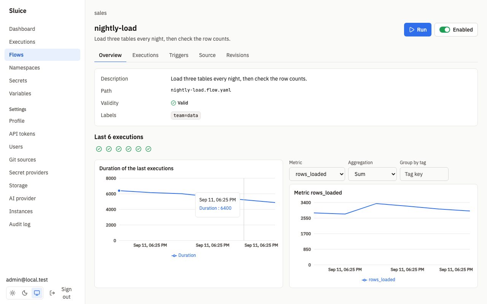
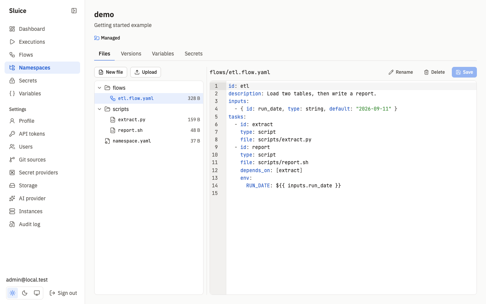
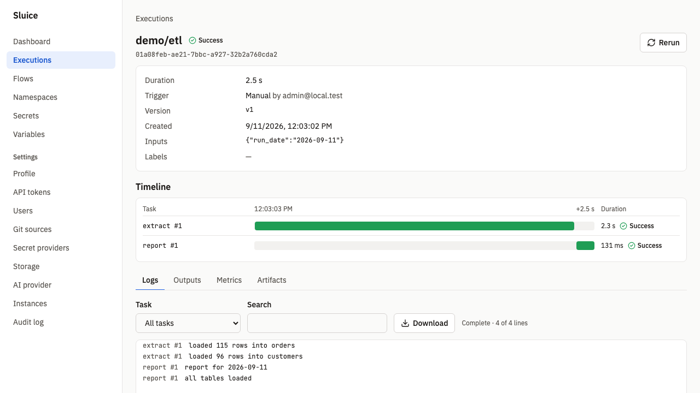

# Sluice

Sluice runs flows of tasks: Python, shell and bun scripts, commands, HTTP calls and subflows. It runs them on a process, docker or kubernetes executor, with schedules, webhooks, secrets, logs, metrics and a web UI. It is one Go binary with Postgres.


## Getting started

You need Docker and [just](https://just.systems).

1. Build the images:

   ```sh
   just build-images
   ```

2. Start Sluice and Postgres:

   ```sh
   export SLUICE_BOOTSTRAP_ADMIN_PASSWORD=change-me-now-1
   export SLUICE_MASTER_KEYS="k1:$(openssl rand -base64 32)"
   docker compose -f deploy/compose/compose.yml up -d
   ```

3. Open <http://localhost:8080> and sign in as `admin@local.test` with the password of step 2.
4. Open **Namespaces**, create a namespace, and add a flow file, for example `hello.flow.yaml`:

   ```yaml
   id: hello
   tasks:
     - id: say
       type: command
       command: ["echo", "hello from sluice"]
   ```

5. Save the file, open **Flows**, select the flow, and click **Run**. The execution page shows the timeline and the logs.

| Dashboard | Flow |
|---|---|
|  |  |
| **Editor** | **Execution** |
|  |  |

## Documentation

| Document | What it holds |
|---|---|
| [docs/ai.md](docs/ai.md) | The assistant, flow authoring, failure triage and the MCP server. |
| [docs/reference/flow.md](docs/reference/flow.md) | The flow file reference. |
| [docs/reference/env.md](docs/reference/env.md) | Every environment variable. |
| [examples/elt](examples/elt/README.md) | An ELT example with dlt and SQLMesh, with demo data. |
| [deploy/helm/sluice](deploy/helm/sluice) | The Helm chart for Kubernetes. |
| [docs/sluice-sdd.md](docs/sluice-sdd.md) | The design: requirements, scenarios and decisions. |
