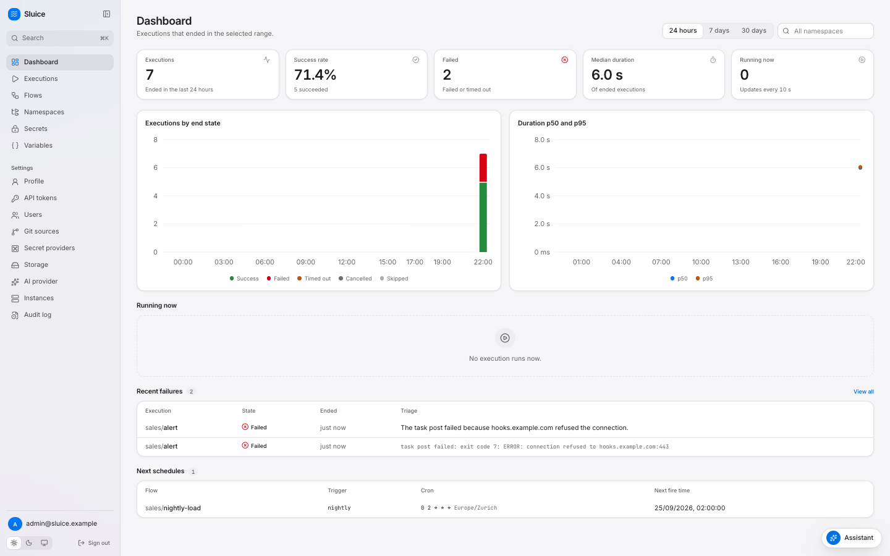
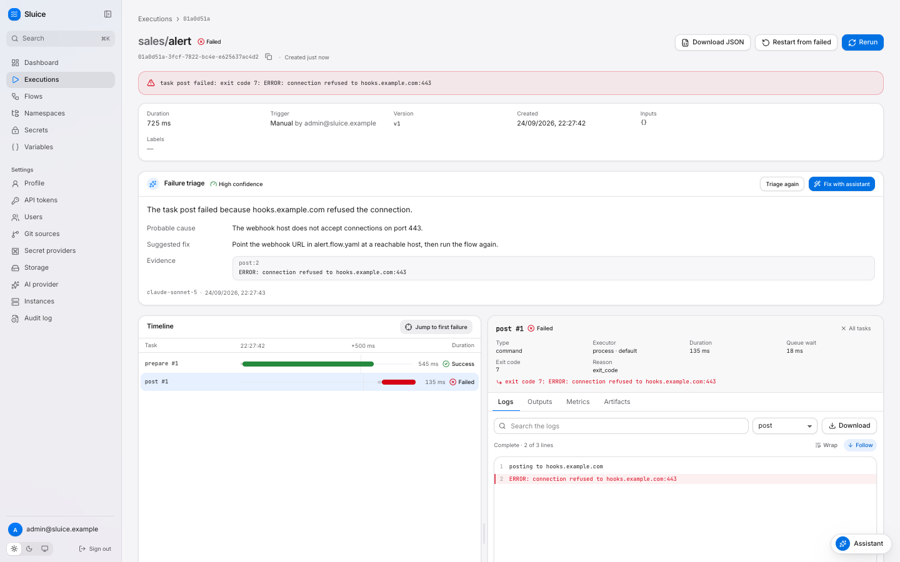
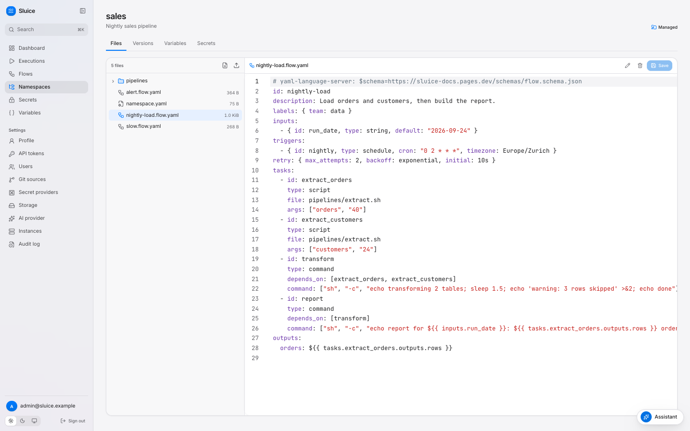
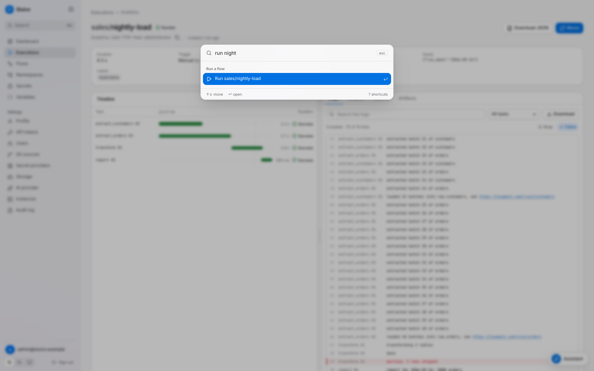

# Sluice

Sluice runs flows of tasks: Python, shell and bun scripts, commands, HTTP calls and subflows. It runs them on a process, docker or kubernetes executor, with schedules, webhooks, secrets, logs, metrics and a web UI. It is one Go binary with Postgres. It has a CLI and an MCP server for CI jobs and coding agents.

**Documentation: [sluice-docs.pages.dev](https://sluice-docs.pages.dev)**


## Quickstart

You need Docker and [just](https://just.systems).

1. Build the images:

   ```sh
   just build-images
   ```

2. Start Sluice and Postgres:

   ```sh
   export SLUICE_BOOTSTRAP_ADMIN_PASSWORD=change-me-now-1
   export SLUICE_MASTER_KEYS="k1:$(openssl rand -base64 32)"
   docker compose -f deploy/compose/compose.yml up -d
   ```

3. Open <http://localhost:8080> and sign in as `admin@local.test` with the password of step 2.
4. Open **Namespaces**, create a namespace, and add a flow file, for example `hello.flow.yaml`:

   ```yaml
   id: hello
   tasks:
     - id: say
       type: command
       command: ["echo", "hello from sluice"]
   ```

5. Save the file, open **Flows**, select the flow, and click **Run**. The execution page shows the tasks and their logs live.

[Run your first flow](https://sluice-docs.pages.dev/tutorials/run-your-first-flow/) is the full tutorial.

## From a terminal, CI or a coding agent

Install the `sluice` binary. The installer checks the download against the published checksum:

```sh
curl -fsSL https://raw.githubusercontent.com/alternayte/sluice/main/install.sh | sh
```

```sh
export SLUICE_URL=http://localhost:8080 SLUICE_TOKEN=<api token>
sluice namespaces push ./flows/sales --namespace sales   # deploy the files as one new version
sluice run sales/nightly-load --wait                     # stream the logs; the exit code is the end state
sluice init                                              # give a coding agent the Sluice skill
```

- [Run flows from GitHub Actions](https://sluice-docs.pages.dev/how-to/run-flows-from-github-actions/) with the action in this repository.
- [Use Sluice with coding agents](https://sluice-docs.pages.dev/how-to/use-sluice-with-coding-agents/): the skill, the MCP server, `llms.txt` and the JSON Schemas.

| Dashboard | Execution |
|---|---|
|  |  |
| **Editor** | **Command palette** |
|  |  |

## Documentation

The docs site has tutorials, how-to guides, concepts, reference and operations pages. Its source is in [`site/`](site/). Every page is also available as Markdown at its URL plus `.md`, and the whole site is in [llms-full.txt](https://sluice-docs.pages.dev/llms-full.txt).

| Document | What it holds |
|---|---|
| [docs/sluice-sdd.md](docs/sluice-sdd.md) | The design: requirements, scenarios and decisions. |
| [docs/specs/](docs/specs/) | The specs of changes after the design. |
| [examples/elt](examples/elt/README.md) | An ELT example with dlt and SQLMesh, with demo data. |
| [CONTRIBUTING.md](CONTRIBUTING.md) | How to build, test and submit a change. |
| [TESTING.md](TESTING.md) | The test layers, the local substitutes and the definition of done. |
| [SECURITY.md](SECURITY.md) | How to report a security defect. |
| [CHANGELOG.md](CHANGELOG.md) | What changed. |

## License

Sluice is free software under the [GNU Affero General Public License v3.0](LICENSE) (AGPL-3.0-only). If you run a changed version of Sluice as a network service, you must offer its source code to the users of that service.
