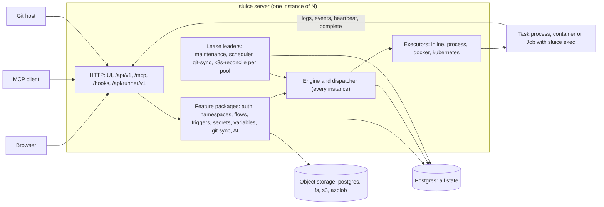
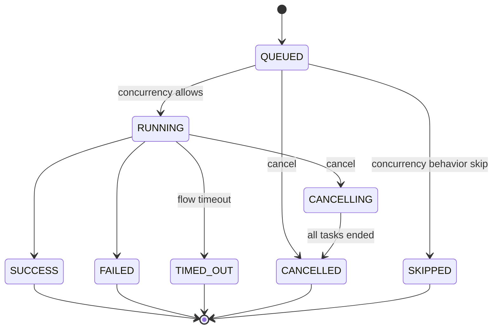
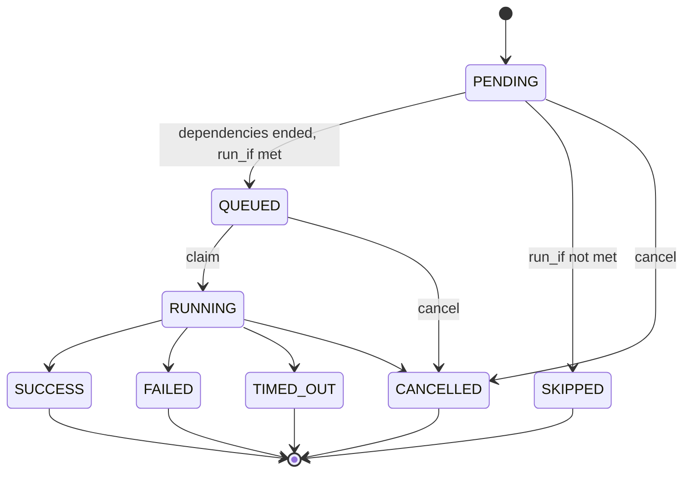

# Architecture

This document describes the components of Sluice and the path of an execution through them. `README.md` links here. The design is in SDD §4, §5 and §6.6, and the implementation decisions are in [build/decisions.md](build/decisions.md).

## Components

Sluice is one Go binary, `sluice`. The same binary is the server, the runner and the CLI (C-01, D-01). Postgres holds all state (C-02). An object store holds file content, bundles, archived logs and artifacts. You can run any number of server instances on one database, also in different clusters (C-05).

| Component | Package | Runs on | What it does |
|---|---|---|---|
| HTTP API and UI | `internal/app`, feature `routes.go` files | every instance | Serves the embedded React UI at `/`, the API at `/api/v1`, MCP at `/mcp`, webhooks at `/hooks` and the runner API at `/api/runner/v1`. See [api.md](api.md). |
| Engine and dispatcher | `internal/execution` | every instance | Starts queued executions, queues ready tasks, claims task runs and finalizes executions (DI-19). |
| Scheduler | `internal/trigger` | `scheduler` lease holder | Fires due schedules once each second (DI-27). See [triggers.md](triggers.md). |
| Git sync | `internal/gitsync` | `git-sync` lease holder | Syncs due git sources once each second. See [git-sync.md](git-sync.md). |
| Maintenance | `internal/app`, `internal/execution`, `internal/storage` | `maintenance` lease holder | Runs the engine checks every 2 s and the cleanup steps every hour. |
| Kubernetes reconciler | `internal/execution` | `k8s-reconcile:<pool>` lease holder | Compares Jobs and task runs of one pool every 60 s (REQ-EXR-006). |
| Executors | `internal/executor` | the instance that claimed the task run | Start, wait for, cancel and check the work of a task run. See [executors.md](executors.md). |
| Runner | `internal/runner` | the task process, container or Job | `sluice exec` gets the spec and the bundle, runs the command and reports to the server. |
| Instance registry | `internal/instance` | every instance | Registers the instance and writes a heartbeat every 10 s (REQ-CORE-007). |
| Storage | `internal/storage` | every instance | One blob interface with the drivers `postgres`, `fs`, `s3` and `azblob` (REQ-STO-001). |

### Commands

| Command | What it does |
|---|---|
| `sluice server` | Runs the HTTP server, the scheduler and the executors. |
| `sluice exec` | Runs one task run as the runner. It reads `SLUICE_API_URL`, `SLUICE_RUN_TOKEN` and `SLUICE_TASK_RUN_ID`. |
| `sluice runner-install <dir>` | Copies the binary into a directory. Kubernetes init containers use it. |
| `sluice migrate` | Applies the database migrations and exits. |
| `sluice user create`, `sluice user reset-password` | Create a user or set a new password directly in the database. |
| `sluice secrets rekey` | Encrypts all builtin secrets again with the active master key. |
| `sluice validate <dir> [--json]` | Validates a namespace directory offline. |
| `sluice openapi` | Prints the OpenAPI document of the API. |
| `sluice version` | Prints the version, the commit and the build date. |

Invalid configuration stops a command with exit code 2 and lists all errors (REQ-CORE-002, SCN-CORE-001). The environment variables are in [reference/env.md](reference/env.md).

### Startup

`sluice server` does these steps in this order:

1. Open the database pool and apply the embedded migrations.
2. Register the readiness checks `database`, `migrations`, `storage` and `master_keys`.
3. Detect the enabled executors. With `SLUICE_EXECUTORS=auto`, `inline` and `process` are always on.
4. Create the bootstrap admin when the `users` table is empty.
5. Register the instance row and start the HTTP listener.
6. Start the heartbeat, the engine loop, the triage worker and the lease leaders.

## Vertical feature packages

Each feature is one package under `internal/` with its routes, service, queries and generated `sqlc` code (D-22). A feature does not import another feature. When a feature needs another one, it declares a small interface, and `internal/app` connects the two. depguard enforces these rules.

| Layer | Packages | Can import |
|---|---|---|
| Kernel | `kernel` | no internal package |
| Platform | `platform/db`, `httpx`, `token`, `clock`, `logging`, `masking`, `lease`, `page`, `health`, `promx` | `kernel`, `platform` |
| Shared domain | `flow`, `snapshot`, `runnerproto`, `storage`, `audit` | `kernel`, `platform`, shared packages |
| Features | `auth`, `instance`, `namespace`, `execution`, `trigger`, `secret`, `variable`, `gitsync`, `metrics`, `ai` | `kernel`, `platform`, shared packages. `execution` also imports `executor`. |
| Assembly | `internal/app` | all packages |

Every API operation declares its access with `httpx.Op` (D-23). The server does not start when an operation has no access or an empty access. The route inventory test `TestSCN_AUTH_006_RouteInventory` calls each route with each role.

## Execution lifecycle

An execution is one run of a flow or of a namespace file. It moves through these steps (SDD §4.3):

1. A trigger creates an `executions` row in state `QUEUED`. The row pins the flow revision and the snapshot.
2. The engine moves the execution to `RUNNING` when the flow concurrency allows it. It creates one `PENDING` task run for each task.
3. Tasks whose dependencies ended become `QUEUED`, limited by `max_parallel`.
4. A dispatcher on any instance claims a `QUEUED` task run and creates a run token. The task run becomes `RUNNING`.
5. The executor starts `sluice exec` with `SLUICE_API_URL`, `SLUICE_RUN_TOKEN` and `SLUICE_TASK_RUN_ID`.
6. The runner gets the spec and the bundle, runs the command, and sends logs, events and heartbeats.
7. The runner posts `complete`. In one transaction the engine sets the task state, applies the retry policy, queues ready tasks and finalizes the execution when all tasks ended.
8. The server revokes the run token and archives the logs of the task run.

Inline tasks, that is `http` and `subflow` tasks, run as goroutines in the instance that claimed them. They use the same state transitions.

### Execution states

| State | Terminal | Description |
|---|---|---|
| `QUEUED` | no | The execution waits for a concurrency slot of its flow. |
| `RUNNING` | no | The execution has task runs. |
| `CANCELLING` | no | A user cancelled the execution. The engine stops its task runs. |
| `SUCCESS` | yes | Every task is `SUCCESS`, or `SKIPPED` with reason `run_if_not_met`. |
| `FAILED` | yes | At least one task did not succeed, or the flow outputs did not resolve. |
| `TIMED_OUT` | yes | The flow `timeout` ended the execution. |
| `CANCELLED` | yes | A cancel ended the execution. |
| `SKIPPED` | yes | The flow has `concurrency.behavior: skip` and its limit was full. |

One transition function enforces these transitions, and the database rejects unknown states (REQ-EXE-002). `TestSCN_EXE_002_StateTransitions` checks every pair of states.

### Task run states

A retry does not change an ended task run. The engine inserts a new `PENDING` task run with the next attempt number and a `not_before` time after the backoff (REQ-EXE-005). Execution outputs use the last attempt.

A dependent task with `run_if: success` needs all its dependencies in `SUCCESS` (DI-21):

- A dependency that failed, timed out, was cancelled or was skipped with `upstream_failed` gives `SKIPPED` with reason `upstream_failed`.
- A dependency that was skipped with `run_if_not_met` gives `SKIPPED` with reason `run_if_not_met`.
- `run_if: failure` runs when at least one dependency is `FAILED` or `TIMED_OUT`.
- `run_if: always` runs when all dependencies ended.

### Reasons

The `reason` field tells why a task run or an execution has its state.

| Reason | Set on | Cause |
|---|---|---|
| `run_if_not_met` | task run | The `run_if` condition was false. |
| `upstream_failed` | task run | A dependency did not succeed. |
| `exit_code` | task run | The command exited with a code other than 0. |
| `http_status` | task run | An `http` task got a status that is not in `expect_status`. |
| `timeout` | task run, execution | The task timeout or the flow timeout passed. |
| `cancelled` | task run, execution | A user cancelled the execution. |
| `lost` | task run | The work is gone, or the instance that claimed the task run is offline. |
| `instance_shutdown` | task run | The instance that claimed the task run received SIGTERM. |
| `template_error` | task run | A template did not resolve at dispatch. |
| `secret_not_found` | task run | A secret key has no value in any scope. |
| `runtime_not_found` | task run | The runtime tool of a script is not on the image. |
| `executor_error` | task run | The executor is not enabled on the instance, or the start failed. |
| `image_pull_failed` | task run | Docker or Kubernetes did not pull the image. |
| `pod_pending_timeout` | task run | The pod stayed in phase `Pending` longer than `SLUICE_K8S_PENDING_TIMEOUT`. |
| `no_instance_for_pool` | queued task run | No online instance serves the pool and the executor type. The reason clears when such an instance comes online. |
| `child_failed` | task run | The child execution of a `subflow` task did not succeed. |
| `depth_exceeded` | task run | A subflow chain is deeper than 10. |
| `output_error` | execution | A flow output did not resolve at `SUCCESS`. |
| `reused` | task run | Restart from failed copied a `SUCCESS` task run of the old execution. |

## Claims

Every instance runs the engine loop. The loop runs each `SLUICE_QUEUE_POLL_INTERVAL`, and also at once after a task ends. One pass does three things:

1. Start queued executions when the concurrency of the flow allows it.
2. Promote retry attempts whose backoff time passed.
3. Claim `QUEUED` task runs.

The claim is one transaction with `SELECT … FOR UPDATE OF t SKIP LOCKED`, in `queued_at` order (D-02, REQ-EXE-010). It takes a task run only when one of these conditions is true:

| Executor type | Condition |
|---|---|
| `inline` | The instance has fewer than 64 inline task runs. Pools do not apply. |
| `process`, `docker` | The type is enabled on the instance, the pool is in `SLUICE_POOLS`, and a slot of `SLUICE_WORKER_SLOTS` is free. |
| `kubernetes` | The type is enabled, the pool is in `SLUICE_POOLS`, and the pool has fewer than `SLUICE_K8S_MAX_JOBS` `RUNNING` kubernetes task runs across all instances. |

The claim sets `claimed_by`, `started_at` and `heartbeat_at`. It stores the SHA-256 hash of a new run token. The token expires at the task timeout plus 10 minutes (SI-04).

`TestSCN_EXE_010_ClaimsAcrossInstances` runs 100 tasks on two instances with 4 slots each. No task is claimed twice, and at most 8 tasks run at one time.

## Heartbeats and lost tasks

The runner sends a heartbeat every 10 s (REQ-RUN-004). The heartbeat response tells the runner to stop when a cancel is requested. For inline task runs, the instance that claimed the task run writes `heartbeat_at` each second.

Sluice finds lost work in three places:

| Check | Runs on | Interval | Action |
|---|---|---|---|
| Heartbeat check | the instance that claimed the task run | 5 s | A `RUNNING` task run with `heartbeat_at` older than `SLUICE_HEARTBEAT_TIMEOUT` is checked with its executor. When the work is gone, the task run becomes `FAILED` with reason `lost`. |
| Offline instances | `maintenance` leader | 2 s | A `RUNNING` task run whose instance is missing or has no heartbeat for 60 s becomes `FAILED` with reason `lost`. A `docker` or `kubernetes` task run also needs a task heartbeat older than `SLUICE_HEARTBEAT_TIMEOUT` (DI-48). |
| Kubernetes reconcile | `k8s-reconcile:<pool>` leader | 60 s | A task run whose Job is gone becomes `FAILED` with reason `lost`. The leader deletes Jobs that have no active task run. |

The retry policy applies to a lost attempt. `TestSCN_EXE_011_LostRunner` kills the runner with SIGKILL, and the retry reaches `SUCCESS`.

The `maintenance` leader also does these checks every 2 s:

- It ends a `RUNNING` execution with `TIMED_OUT` after its flow deadline.
- It marks a `RUNNING` task run `TIMED_OUT` when the task timeout passed by more than 60 s without a `complete` call (DI-20).
- It sets or clears `no_instance_for_pool` on queued task runs (REQ-EXR-008).

### Cancel

A cancel of a `QUEUED` execution sets `CANCELLED` at once. A cancel of a `RUNNING` execution sets `CANCELLING` and does these steps:

1. Cancel the `PENDING` and `QUEUED` task runs.
2. Set `cancel_requested` on the `RUNNING` task runs, and cancel the child executions of `subflow` tasks.
3. The instance that claimed the task run reads `cancel_requested` each second. Then it calls the executor cancel.
4. The runner sends SIGTERM to the process group, and SIGKILL after 10 s.
5. The execution becomes `CANCELLED` when all task runs ended.

### Shutdown

On SIGTERM the instance stops claims. It cancels its `process` and `inline` task runs and marks them `FAILED` with reason `instance_shutdown`. The retry policy applies. Docker and Kubernetes tasks continue. The instance releases its leases and exits within `SLUICE_SHUTDOWN_GRACE` (REQ-CORE-008, `TestSCN_CORE_007_GracefulShutdown`).

## Instances

Each instance writes a row in `instances` with its hostname, version, pools and executors. It writes a heartbeat every 10 s. An instance is offline after 60 s without a heartbeat. The `maintenance` leader deletes rows without a heartbeat for 24 h (REQ-CORE-007, `TestSCN_CORE_006_InstancesRegistry`). The operator view of instances is in [operations/runbook.md](operations/runbook.md#instances).

## Snapshots and bundles

Namespace content is content-addressed (D-05):

| Object | Key | Content |
|---|---|---|
| File object | `files/sha256/<hash>` | The bytes of one file. The same content in two namespaces is one object (`TestSCN_STO_004_DeduplicatedFileObjects`). |
| Snapshot | `snapshots` and `snapshot_files` rows | A manifest of path, hash, size and executable flag for each file of one namespace version. |
| Manifest hash | `snapshots.manifest_hash` | The SHA-256 of the sorted manifest lines `path\0hash\0x` or `path\0hash\0-`. |
| Bundle | `bundles/<manifest_hash>.tar.gz` | A tar.gz of all files of a manifest. |

A managed namespace creates a snapshot for each save. A git namespace creates a snapshot when a sync finds a changed manifest. The namespace row points to its head snapshot.

A new execution pins the namespace head snapshot at creation, with the definition of the current flow revision (DI-41). It stores this effective definition, with the `namespace.yaml` defaults of the snapshot, in `executions.definition` (DI-18). Later changes to files do not change a pinned execution. Rerun and restart from failed use the snapshot and the definition of the old execution. Two tests prove this behaviour: `TestSCN_EXE_001_PinnedSnapshot` and `TestSCN_EXE_001_NextExecutionPinsHead`.

The server builds the bundle of a manifest the first time a runner asks for it. Later requests use the stored bundle and update `bundles.last_used_at`. The runner extracts the bundle into the workdir. Extraction rejects absolute paths, `..` segments, links and special files (SI-08).

## Leases and leaders

Leader election uses the `leases` table, not session locks (D-02, C-06). A lease has a TTL of 15 s. The holder renews it every 5 s (REQ-CORE-006).

| Lease | Work while held | Interval |
|---|---|---|
| `maintenance` | Engine checks: flow deadlines, task deadlines, offline instances, `no_instance_for_pool`. | 2 s |
| `maintenance` | Cleanup steps: `instances`, `sessions`, `audit`, `retention`, `storage_gc`. | 1 h, and once at lease start |
| `scheduler` | Fire due schedules. | 1 s |
| `git-sync` | Sync due git sources. | 1 s |
| `k8s-reconcile:<pool>` | Reconcile the Jobs of one pool. Only instances with the `kubernetes` executor compete, one lease for each pool in `SLUICE_POOLS`. | 60 s |

The lease rules:

- An instance takes a lease when no row exists, when the row expired, or when it already holds the lease.
- The lease expiry uses the application clock as a statement parameter, not `now()` (DI-3).
- A leader-only write adds a lease guard to its `WHERE` clause. The check and the write are one statement, so a former leader cannot write.
- When a renew fails to keep the lease, the instance stops the leader work.
- At shutdown the instance deletes its lease rows.

`TestSCN_CORE_005_LeaseHandover` shows that a second instance takes the `scheduler` lease within 20 s, and that a write from the old holder is rejected. `TestSCN_CORE_004_ThroughPgBouncer` hands over the lease through PgBouncer in transaction mode.

## Log ingest and archive

The runner sends log lines in batches of at most 500 ms or 256 KiB, each with a `seq` that is higher than the `seq` of the batch before (REQ-RUN-002). The runner cuts lines longer than 16 KiB and adds a marker.

The server stores a batch like this:

1. Ignore a batch whose `(task_run_id, seq)` is already stored. Ingest is idempotent.
2. Mask the secret values of the task run again (SI-10).
3. Give each line a line number and a stream: `stdout`, `stderr` or `system`.
4. Write the batch as one gzip NDJSON row in `log_chunks`.

When a task run ends, the server writes all its lines to `logs/<execution_id>/<task_run_id>.ndjson.gz` in storage. Then it deletes the chunks from Postgres. When all task runs of an execution ended and have no chunks, the server sets `executions.log_archived`.

The log API and the log stream read the archive and the chunks, and merge them by line number (REQ-RUN-008). The API is in [api.md](api.md#server-sent-events). These tests prove the path: `TestSCN_RUN_001_InterleavedLines`, `TestSCN_RUN_002_LongLineTruncated`, the Playwright test `SCN-RUN-008` and `TestSCN_NFR_002_LogIngest`.

## Retention and storage GC

The `maintenance` leader runs these cleanup steps every hour:

| Step | Deletes |
|---|---|
| `instances` | Instance rows without a heartbeat for 24 h. |
| `sessions` | Expired sessions, and login attempts older than 24 h. |
| `audit` | Audit events older than 365 days. |
| `retention` | Executions that ended more than `SLUICE_RETENTION_DAYS` ago, in batches of 200. |
| `storage_gc` | Unused storage objects. This step runs at most once in 24 hours. |

The `retention` step first deletes the objects under `logs/<execution_id>/` and `artifacts/<execution_id>/`. Then it deletes the execution row. The database deletes the task runs, log chunks, metrics, artifacts and AI insights of the execution with it (REQ-EXE-014, `TestSCN_EXE_014_Retention`).

The `storage_gc` step keeps the time of its last run in the `settings` row `maintenance.storage_gc_last_run` (DI-17). It deletes:

| Object | Condition |
|---|---|
| Bundle | `last_used_at` is older than 7 days. |
| File object | No snapshot references the hash, and the row is older than 1 hour. |
| Stored file without a row | No `file_objects` row has the hash, and the object is older than 1 hour. |
| Logs and artifacts | The execution row is gone, and the object is older than 1 hour. |

A save takes `FOR SHARE` on the file object row, and GC takes `FOR UPDATE SKIP LOCKED`. Thus GC cannot delete content that a concurrent save references. `TestSCN_STO_005_GarbageCollection` proves the rules with a fake clock.

## Related documents

- [api.md](api.md): the HTTP API.
- [operations/runbook.md](operations/runbook.md): operator procedures.
- [operations/metrics.md](operations/metrics.md): Prometheus metrics and dashboard KPIs.
- [flows.md](flows.md), [triggers.md](triggers.md), [executors.md](executors.md), [git-sync.md](git-sync.md), [deployment.md](deployment.md).
