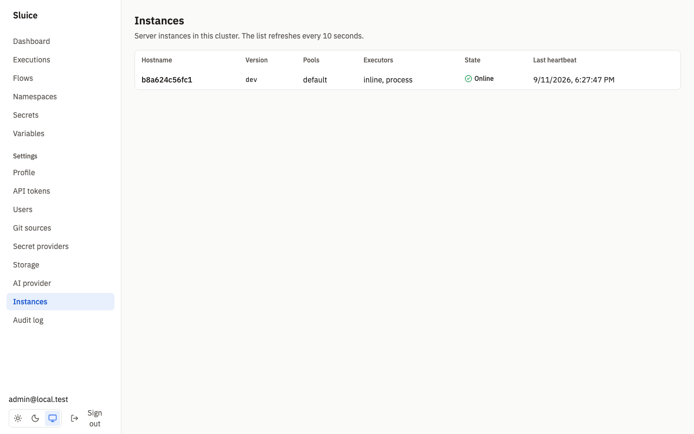
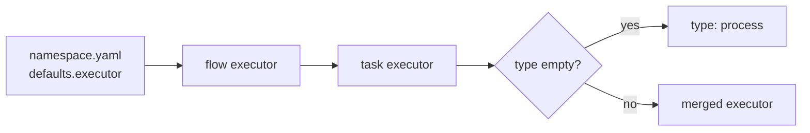
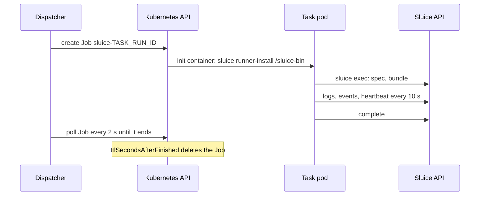
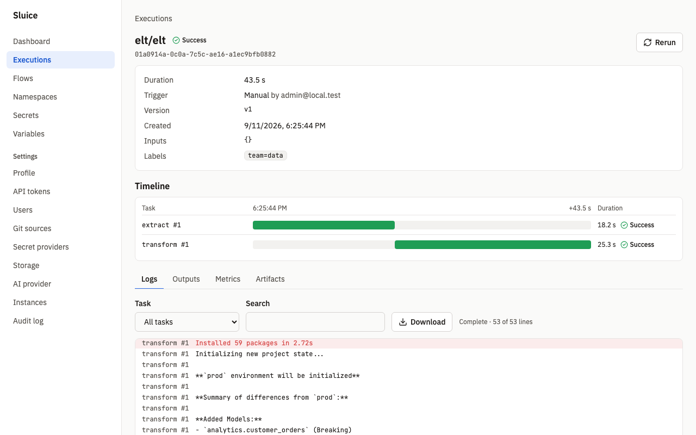

# Executors

This document holds the reference of the executors, the pools, the worker slots and the runner. `README.md` links here. The design is in SDD §7.9 and in the decisions DI-18, DI-19, DI-20, DI-34 and DI-35 of [build/decisions.md](build/decisions.md).

An executor starts the work of one task run. Sluice has four executors. All four use one interface: start, wait, cancel and status by external reference (REQ-EXR-001).

| Executor | Task types | Where the work runs | Enabled | Capacity per instance |
|---|---|---|---|---|
| `inline` | `http`, `subflow` | A goroutine in the instance that claims the task. | Always. | 64 inline tasks at the same time. This value has no environment variable. |
| `process` | `script`, `command` | A `sluice exec` child process of the server. | Always with `auto`. | `SLUICE_WORKER_SLOTS`, shared with `docker`. |
| `docker` | `script`, `command` | A container that the Docker Engine API creates. | With `auto`, when the Docker API answers. | `SLUICE_WORKER_SLOTS`, shared with `process`. |
| `kubernetes` | `script`, `command` | One Kubernetes Job per attempt. | With `auto`, when a Job create dry run succeeds. | `SLUICE_K8S_MAX_JOBS` per pool. |

You cannot select `inline` in a flow. `http` and `subflow` tasks always run inline. An `executor` block on an `http` or `subflow` task is the validation error `executor_not_allowed`.

Every variable in this document is in [reference/env.md](reference/env.md) with its default.

## Enable executors

`SLUICE_EXECUTORS` selects the executors of an instance. The default is `auto`.

| Value | Result |
|---|---|
| `auto` | `inline` and `process` are always on. `docker` is on when the Docker API answers a ping within 2 s. `kubernetes` is on when the cluster configuration works and a Job create dry run in the Job namespace succeeds within 5 s. |
| A comma-separated list of `process`, `docker` and `kubernetes` | Exactly these executors, plus `inline`. Sluice does no detection. |

Rules:

- `auto` cannot be combined with other values. Startup stops with exit code 2.
- An unknown name stops startup with exit code 2.
- `inline` is always on. You can write it in the list, but it changes nothing.
- An explicit list without `process` turns the process executor off. For example, `SLUICE_EXECUTORS=kubernetes` gives `inline` and `kubernetes` only.
- With an explicit list, the server creates the Docker or Kubernetes client at start. A Kubernetes client that has no configuration stops startup. The server does not ping the Docker API at start.

Kubernetes detection uses the in-cluster configuration. When `SLUICE_K8S_KUBECONFIG` is set, it uses that kubeconfig file. The test `SCN-EXR-001` proves the detection without Docker and cluster, with a Docker daemon, with a kubeconfig to kind, and with `SLUICE_EXECUTORS=process`.

Each instance registers its pools and its executors. Admins see them on **Settings → Instances** (`/settings/instances`) and with `GET /api/v1/instances`. The test `SCN-CORE-006` proves the registry.



```sh
curl -s -H "Authorization: Bearer $SLUICE_TOKEN" https://sluice.example.com/api/v1/instances
```

```json
{"items":[{"id":"01a09149-a333-7caa-8c19-50c684c9c839","hostname":"b8a624c56fc1","version":"dev",
  "pools":["default"],"executors":["inline","process"],"started_at":"2026-09-11T16:25:17.557568Z",
  "heartbeat_at":"2026-09-11T16:30:07.621704Z","online":true}]}
```

## Choose the executor of a task

A task gets its executor from four levels. The resolution order is task, flow, `namespace.yaml`, instance default (SDD §6.4).

Sluice merges the levels field by field. It starts with `defaults.executor` of `namespace.yaml`. Then the flow `executor` replaces each field that it sets. Then the task `executor` replaces each field that it sets. A task can thus set only `pool` and keep the type and the image of the flow.

After the merge, an empty `type` becomes `process` and an empty `pool` becomes `default`. The instance default is always `process` (DI-18). No variable changes it.



```yaml
# namespace.yaml
defaults:
  executor: { type: kubernetes, pool: cluster-a, image: ghcr.io/acme/elt:1.4.0 }
```

```yaml
# elt.flow.yaml
id: elt
tasks:
  - id: extract            # kubernetes, cluster-a, ghcr.io/acme/elt:1.4.0
    type: script
    file: pipelines/orders.py
  - id: gpu_model          # kubernetes, pool gpu, same image
    type: script
    file: pipelines/model.py
    depends_on: [extract]
    executor: { pool: gpu }
```

The test `SCN-NS-006` proves that `namespace.yaml` defaults apply and that flow values replace them.

### Executor fields

| Field | Applies to | Default | Rule |
|---|---|---|---|
| `type` | all | `process` | `process`, `docker` or `kubernetes`. |
| `pool` | all | `default` | `^[a-z0-9-]+$`, 63 characters maximum. |
| `image` | `docker`, `kubernetes` | none | Required for these types. |
| `inject_runner` | `docker`, `kubernetes` | `true` | `false` runs `sluice` from the image `PATH`. |
| `pull` | `docker` | `if_not_present` | `always`, `if_not_present` or `never`. |
| `network` | `docker` | Docker default network | Docker network name. |
| `resources` | `docker`, `kubernetes` | none | `requests` and `limits` with `cpu` and `memory`. Docker uses only `limits`. |
| `kubernetes` | `kubernetes` | none | `service_account`, `node_selector`, `tolerations`, `image_pull_secrets`, `labels`, `annotations`. |

`cpu` matches `^[0-9]+(\.[0-9]+)?m?$`, for example `500m` or `2`. `memory` matches `^[0-9]+(Ki|Mi|Gi|Ti|K|M|G|T)?$`, for example `512Mi`. The full field list is in [reference/flow.md](reference/flow.md).

Validation errors:

| Code | Cause |
|---|---|
| `image_required` | The merged type is `docker` or `kubernetes` and no level sets `image`. |
| `field_not_allowed` | An executor block sets a field that its own `type` does not accept. For example, `pull` with `type: kubernetes`. |
| `executor_not_allowed` | An `http` or `subflow` task has an `executor` block. |

## Pools

A pool is a name that connects tasks to instances. `SLUICE_POOLS` lists the pools of an instance, separated by commas. The default is `default`. A task goes to the pool in its `executor.pool`.

An instance claims a task only when the task pool is in `SLUICE_POOLS` and the task executor is enabled on the instance. Inline tasks have no pool. Any instance can claim them.

Pool names must match `^[a-z0-9-]+$` and have 63 characters maximum. An invalid name in `SLUICE_POOLS` stops startup with exit code 2.

When no online instance serves the pool and the executor of a queued task, the task shows the reason `no_instance_for_pool`. The maintenance leader sets and clears this reason every 2 s. The task stays `QUEUED`. It starts when an instance with that pool and that executor comes online. The test `SCN-EXR-008` proves this with the pool `gpu`.

```sh
SLUICE_POOLS=default,gpu SLUICE_EXECUTORS=process,docker sluice server
```

Pools also connect instances in different clusters on one database. See [deployment.md](deployment.md#multiple-instances-and-leases).

## Claims and worker slots

Every instance runs the dispatcher. It claims `QUEUED` task runs with `SELECT … FOR UPDATE SKIP LOCKED`, oldest first. It polls every `SLUICE_QUEUE_POLL_INTERVAL`, and it also wakes when a local task ends. Two instances never claim the same task run. The test `SCN-EXE-010` proves this with two instances, 4 slots each and 100 tasks.

| Limit | Variable | Default | Scope |
|---|---|---|---|
| Process and docker tasks | `SLUICE_WORKER_SLOTS` | `8` | One instance. `0` is allowed: the instance then claims no process and no docker task. |
| Kubernetes Jobs | `SLUICE_K8S_MAX_JOBS` | `50` | One pool. Sluice counts the `RUNNING` kubernetes task runs of the pool in the database, over all instances. |
| Inline tasks | none | `64` | One instance. |

A claim sets the task run to `RUNNING` and creates a run token. Then the executor starts the work.

## The runner

The runner is the `sluice exec` command of the same binary (D-01). It runs next to the task command on every executor except `inline`. It gets the spec and the bundle from the server, runs the command, pushes logs, events and heartbeats, and posts `complete` (REQ-RUN-001).

The executor gives the runner three variables:

| Variable | Value |
|---|---|
| `SLUICE_API_URL` | `process`: `SLUICE_INTERNAL_URL`. `docker`: `SLUICE_DOCKER_API_URL`. `kubernetes`: `SLUICE_INTERNAL_URL`. |
| `SLUICE_RUN_TOKEN` | A token for this task run only. It expires at the task timeout plus 10 minutes. The server revokes it at the terminal state (SI-04). |
| `SLUICE_TASK_RUN_ID` | The task run ID. |

The runner reads the resolved environment, secrets included, from the API at run time (D-03). No secret value goes into a process environment of the server, a Docker container configuration or a Kubernetes object. The tests `SCN-EXR-005` and `SCN-SEC-010` search the Job, the Pod and the `docker inspect` output for a secret canary.

The task command gets the variables of SDD §6.10: `SLUICE_EXECUTION_ID`, `SLUICE_TASK_ID`, `SLUICE_ATTEMPT`, `SLUICE_NAMESPACE`, `SLUICE_FLOW_ID`, `SLUICE_OUTPUTS`, `SLUICE_WORKDIR`, plus the resolved `env`. See [flows.md](flows.md).

### Runtime tools

A `script` task needs its runtime tool in the image or on the host:

| Runtime | Command | Tool |
|---|---|---|
| `python` | `uv run <file> <args>` | `uv` |
| `bash` | `bash <file> <args>` | `bash` |
| `bun` | `bun run <file> <args>` | `bun` |
| `node` | `node <file> <args>` | `node` |

A tool that is not on `PATH` fails the task with the reason `runtime_not_found` and names the tool. The test `SCN-RUN-007` runs python, bash and bun scripts in `sluice-uv`, and fails a bun script in `sluice`.

### Runner injection

With `inject_runner: true`, the default, any Linux image can run a task. Sluice copies the runner binary into the task container. The binary comes from `SLUICE_RUNNER_IMAGE` at the path `/usr/local/bin/sluice` (D-04). The default of `SLUICE_RUNNER_IMAGE` is `sluice:<version>`.

| Executor | Injection |
|---|---|
| `docker` | The server copies the binary once from `SLUICE_RUNNER_IMAGE` into a tar file in its temporary directory. For each task, it copies the tar into the created container at `/sluice-bin/sluice` with the Engine API. The entrypoint is `/sluice-bin/sluice exec`. |
| `kubernetes` | An init container `sluice-runner` from `SLUICE_RUNNER_IMAGE` runs `sluice runner-install /sluice-bin`. It writes the binary into an `emptyDir`. The task container runs `/sluice-bin/sluice exec`. |

With `inject_runner: false`, the task container runs `sluice exec` from the image `PATH`. Sluice does no copy and adds no init container (REQ-EXR-007). Both Sluice images have `sluice` at `/usr/local/bin/sluice`. The test `SCN-EXR-004` runs `sluice-uv` with `inject_runner: false`.

```yaml
executor: { type: docker, image: "sluice-uv:1.0.0", inject_runner: false }
```

### The Sluice images

Two images build from `deploy/docker/Dockerfile` (REQ-DEP-001). Both run as the non-root user 65532.

| Image | Base | Contents |
|---|---|---|
| `sluice` | `gcr.io/distroless/static-debian12:nonroot` | The `sluice` binary only. No shell. |
| `sluice-uv` | `debian:bookworm-slim` | The `sluice` binary, `bash`, `ca-certificates`, `git`, `uv` and `uvx`, a uv-managed Python 3.12 in `/opt/uv/python`, and `bun`. |

`sluice-uv` sets these variables, so that it also works with a read-only root file system:

| Variable | Value |
|---|---|
| `UV_PYTHON_INSTALL_DIR` | `/opt/uv/python` |
| `UV_PYTHON_PREFERENCE` | `only-managed` |
| `UV_CACHE_DIR` | `/tmp/uv-cache` |
| `UV_LINK_MODE` | `copy` |
| `BUN_INSTALL_CACHE_DIR` | `/tmp/bun-cache` |

Use `sluice-uv` for the server when tasks run on the process executor. Use it as the task image when you want Python, bash and bun without an image of your own. The test `SCN-DEP-001` builds both images and checks the user and the tools.

## Process executor

The process executor starts `sluice exec` from `os.Executable()`, that is the binary of the server (REQ-EXR-003). The runner runs in its own process group. It calls the server at `SLUICE_INTERNAL_URL`, by default `http://127.0.0.1:<port>`.

The runner inherits only these server variables: `PATH`, `HOME`, `USER`, `LANG`, `LC_ALL`, `TMPDIR`, `TZ`, `SSL_CERT_FILE`, `SSL_CERT_DIR`, `UV_CACHE_DIR`, `UV_PYTHON_INSTALL_DIR`, `BUN_INSTALL`, `XDG_CACHE_HOME`, `HTTP_PROXY`, `HTTPS_PROXY`, `NO_PROXY`. The server configuration, for example `SLUICE_DATABASE_URL` and `SLUICE_MASTER_KEYS`, does not go to tasks.

**Cancel.** The runner sends SIGTERM to the task process group and SIGKILL 10 s later (REQ-RUN-004). The process executor also sends SIGTERM to the whole group of the runner. It sends SIGKILL to that group when the runner has not ended after 12 s. The test `SCN-EXR-002` proves that a cancel removes a grandchild process too.

**Shutdown.** On SIGTERM the instance stops claims and stops its process and inline tasks. These tasks become `FAILED` with the reason `instance_shutdown`, and the retry policy applies (REQ-CORE-008). Docker and Kubernetes tasks continue. The test `SCN-CORE-007` proves that the retry runs on a second instance.

## Docker executor

The docker executor uses the Docker Engine API client from `DOCKER_HOST` and the other standard Docker client variables (DI-34).

### Pull policy

| `pull` | Behaviour |
|---|---|
| `if_not_present` | Default. Sluice pulls the image when the engine does not have it. |
| `always` | Sluice pulls the image before each task. |
| `never` | Sluice does not pull. An image that is not present fails the task. |

A pull failure, or an absent image with `never`, fails the task with the reason `image_pull_failed` before a container starts. The test `SCN-EXR-004` proves this with an image that does not exist.

Sluice pulls `SLUICE_RUNNER_IMAGE` with `if_not_present` when it needs the runner binary for the first time.

### The task container

| Property | Value |
|---|---|
| Name | `sluice-<task_run_id>` |
| Labels | `sluice.dev/execution-id`, `sluice.dev/task-run-id`, `sluice.dev/pool`, `sluice.dev/managed-by=sluice` |
| Volumes and binds | None. The runner binary goes in with a copy (C-03). |
| Init process | On. |
| Extra host | `host.docker.internal:host-gateway`, so that Linux engines reach the server. |
| Network | `executor.network`. Empty uses the Docker default network. |
| Environment | The three runner variables only. |
| CPU | `resources.limits.cpu`, as nano CPUs. |
| Memory | `resources.limits.memory`, in bytes. |

Docker ignores `resources.requests`. The test `SCN-EXR-003` runs a task in `python:3.12-slim`. `docker inspect` shows no mounts during the run, and the container is gone after completion.

```yaml
executor:
  type: docker
  image: python:3.12-slim
  pull: always
  network: etl
  resources: { limits: { cpu: "1.5", memory: 1Gi } }
tasks:
  - id: hello
    type: command
    command: ["python3", "-c", "print('hello')"]
```

### Network access to the server

The runner in the container calls `SLUICE_DOCKER_API_URL`. The default is `http://host.docker.internal:<port>`. The server must listen on an address that the container can reach. The default listen address `:8080` listens on all interfaces. When you set `executor.network`, make sure that `SLUICE_DOCKER_API_URL` resolves from that network.

### After the task

| Event | Behaviour |
|---|---|
| The container ends | Sluice removes it. With `SLUICE_DOCKER_KEEP_CONTAINERS=true`, it keeps it. |
| Cancel | Sluice stops the container with a 10 s grace, then removes it (REQ-EXR-009). This also applies when `SLUICE_DOCKER_KEEP_CONTAINERS` is `true`. |
| Server start | The sweep removes stopped containers with the label `sluice.dev/managed-by=sluice`, in the states `exited`, `created` and `dead`. It does not touch containers that run. With `SLUICE_DOCKER_KEEP_CONTAINERS=true`, the sweep does nothing. |

## Kubernetes executor

The kubernetes executor creates one Job per attempt (REQ-EXR-005, DI-35). The Job namespace is `SLUICE_K8S_NAMESPACE`. When it is empty, Sluice uses the namespace of the server pod. Outside a pod, it uses `default`.

The server needs these permissions in the Job namespace. The Helm chart grants them. See [deployment.md](deployment.md#kubernetes-with-helm).

| API group | Resource | Verbs |
|---|---|---|
| `batch` | `jobs` | create, get, list, watch, delete |
| core | `pods` | get, list, watch |
| core | `pods/log` | get |

### The Job

| Property | Value |
|---|---|
| Name | `sluice-<task_run_id>` |
| `backoffLimit` | `0`. Retries are execution retries (D-20). |
| `restartPolicy` | `Never` |
| `activeDeadlineSeconds` | The task timeout in seconds. The default task timeout is 24 h. |
| `ttlSecondsAfterFinished` | `SLUICE_K8S_JOB_TTL`. Default `600s`. |
| Labels on the Job and the pod | `sluice.dev/execution-id`, `sluice.dev/task-run-id`, `sluice.dev/pool`, `sluice.dev/managed-by=sluice`, plus `kubernetes.labels`. A Sluice label replaces a user label with the same key. |
| Annotations on the Job and the pod | `kubernetes.annotations` |
| Init container | `sluice-runner` from `SLUICE_RUNNER_IMAGE`. Only with `inject_runner: true`. |
| Task container | `task` from `executor.image`. |
| Volumes | `emptyDir` `workdir` at `/workdir`. With injection, also `emptyDir` `sluice-bin` at `/sluice-bin`. No other volume. |
| Work directory | `/workdir`. `SLUICE_WORKDIR` is `/workdir`. |
| Environment | The three runner variables and `SLUICE_WORKDIR`. |

The run token is in the Job environment. It is valid for one task run and it expires (SI-04). User secret values are never in the Job. The test `SCN-EXR-005` checks the fields, the labels and the volumes, and it searches the Job and Pod JSON for a secret canary.

### Pod fields

| Flow field | Pod field |
|---|---|
| `resources.requests` | `resources.requests` of the task container |
| `resources.limits` | `resources.limits` of the task container |
| `kubernetes.service_account` | `serviceAccountName` |
| `kubernetes.node_selector` | `nodeSelector` |
| `kubernetes.tolerations[]` | `tolerations`, with `key`, `operator`, `value`, `effect`, `toleration_seconds` |
| `kubernetes.image_pull_secrets[]` | `imagePullSecrets` |
| `kubernetes.labels` | Labels of the Job and the pod |
| `kubernetes.annotations` | Annotations of the Job and the pod |

Sluice does not set `imagePullPolicy`, so the Kubernetes default applies. The `pull` field is for `docker` only.

```yaml
executor:
  type: kubernetes
  pool: cluster-a
  image: ghcr.io/acme/elt:1.4.0
  resources:
    requests: { cpu: 500m, memory: 512Mi }
    limits: { cpu: "2", memory: 2Gi }
  kubernetes:
    service_account: elt
    node_selector: { workload: batch }
    tolerations:
      - { key: batch, operator: Equal, value: "true", effect: NoSchedule }
    image_pull_secrets: [ghcr]
    labels: { team: data }
    annotations: { cost-center: "42" }
```

### Life of a Job



The executor polls the Job every 2 s. It reads the exit code of the `task` container. It ends the wait early when the init container or the task container waits with `ErrImagePull`, `ImagePullBackOff`, `InvalidImageName` or `ErrImageNeverPull`. Then it deletes the Job and fails the task with `image_pull_failed`.

**Cancel.** Sluice deletes the Job with background propagation (REQ-EXR-009). The test `SCN-EXR-006` proves that the pod is gone within 30 s.

**Server restart.** A Kubernetes task continues when the server stops. The runner sends its data to any instance. The test `SCN-EXR-007` restarts the server pod during a run, and the task reaches `SUCCESS`.

### The reconciler

Each pool of an instance with the kubernetes executor has a lease `k8s-reconcile:<pool>`. The holder of the lease makes one pass every 60 s (REQ-EXR-006). It lists the Jobs with the labels `sluice.dev/managed-by=sluice` and `sluice.dev/pool=<pool>`.

| Condition | Action |
|---|---|
| A Job has no `RUNNING` task run, and the Job has not ended or has no `sluice.dev/task-run-id` label | Delete the Job. |
| A Job has no `RUNNING` task run and has ended | Keep it. `ttlSecondsAfterFinished` deletes it. |
| A container of the pod cannot pull its image | Delete the Job. The task becomes `FAILED` with `image_pull_failed`. |
| The pod stays `Pending` longer than `SLUICE_K8S_PENDING_TIMEOUT` | Delete the Job. The task becomes `FAILED` with `pod_pending_timeout`. |
| A `RUNNING` kubernetes task run of the pool has no Job | The task becomes `FAILED` with `lost`. |

The retry policy applies to all these failures. The pass interval is 60 s. A `pod_pending_timeout` failure can thus come up to 60 s after the limit.

A runner that reports `cancelled` without a cancel request ends the attempt `FAILED` with `lost` (DI-35). For example, a Job deleted by hand or an evicted pod. The test `SCN-EXR-007` proves the orphan Job, the Job deleted by hand with a retry to `SUCCESS`, `pod_pending_timeout` and `image_pull_failed`.

## Heartbeats and lost tasks

The runner sends a heartbeat every 10 s. The heartbeat answer tells the runner to stop when a cancel is requested (REQ-RUN-004).

Sluice finds lost work in three ways:

| Check | Who | Interval | Rule |
|---|---|---|---|
| Heartbeat check | The instance that claimed the task | 5 s | A `RUNNING` task run without a heartbeat for `SLUICE_HEARTBEAT_TIMEOUT` goes to its executor. When the executor reports that the work is gone, the attempt becomes `FAILED` with `lost`. When the work still exists, nothing changes. |
| Offline instance | The maintenance leader | 2 s | A `RUNNING` task run whose instance is missing or offline becomes `FAILED` with `lost`. A docker or kubernetes task run also needs a task heartbeat older than `SLUICE_HEARTBEAT_TIMEOUT`, because its container or Job can continue without the instance (DI-48). An instance is offline after 60 s without an instance heartbeat. |
| Kubernetes reconciler | The `k8s-reconcile:<pool>` leader | 60 s | See [the reconciler](#the-reconciler). |

`SLUICE_HEARTBEAT_TIMEOUT` defaults to `60s`. For inline tasks, the instance that claimed the task writes the heartbeat every second. Subflow tasks have no heartbeat check. They end with their child execution.

A `lost` attempt is a failure, so the retry policy applies. The test `SCN-EXE-011` kills the runner with SIGKILL. After the heartbeat timeout the attempt is `FAILED` with `lost`, and the retry reaches `SUCCESS`.

The engine has one more safety net. It marks a `RUNNING` task `TIMED_OUT` when the task passes its timeout by 60 s without a `complete` call (DI-20).

### Task reasons of the executors

| Reason | State | Cause |
|---|---|---|
| `no_instance_for_pool` | `QUEUED` | No online instance serves the pool and the executor of the task. |
| `image_pull_failed` | `FAILED` | Docker: the pull failed or the image is absent with `pull: never`. Kubernetes: a container cannot pull its image. |
| `pod_pending_timeout` | `FAILED` | The pod stayed `Pending` longer than `SLUICE_K8S_PENDING_TIMEOUT`. |
| `lost` | `FAILED` | The work is gone without a `complete` call. |
| `instance_shutdown` | `FAILED` | The instance stopped during a process or inline task. |
| `runtime_not_found` | `FAILED` | The runtime tool of a script is not on `PATH`. |
| `executor_error` | `FAILED` | The executor did not start the work, or the executor is not enabled on the instance that claimed the task. |

The full list of reasons is in [flows.md](flows.md). To fix common failures, see [operations/runbook.md](operations/runbook.md).

## Faster dependency installs

`uv` installs the Python packages when a task starts. The time depends on the executor:

- Process executor: `uv` keeps its cache in the Sluice container. Only the first run downloads the packages.
- Docker and kubernetes executors: each task starts in a new container with an empty cache. Each run downloads the packages again.

For docker and kubernetes, build an image that already holds the packages:

```dockerfile
FROM sluice-uv:<version>
RUN uv pip install --system --python 3.12 "dlt[postgres,sql_database]==1.30.0" "psycopg2-binary==2.9.13" "sqlalchemy==2.0.52" "sqlmesh==0.236.2"
```

Then set the image in `namespace.yaml`:

```yaml
defaults:
  executor: { type: kubernetes, image: <your-image> }
```

`uv` finds the installed packages and does not download them. The full example is in [examples/elt/README.md](../examples/elt/README.md#faster-runs).



## Related documents

- [flows.md](flows.md): tasks, retries, timeouts and the emit protocol.
- [deployment.md](deployment.md): images, Helm, pools across clusters and the CLI.
- [architecture.md](architecture.md): the execution lifecycle and the leases.
- [secrets-and-variables.md](secrets-and-variables.md): how the runner gets secrets.
- [operations/metrics.md](operations/metrics.md): queue depth and task run metrics.
- [reference/flow.md](reference/flow.md) and [reference/env.md](reference/env.md): the generated references.
