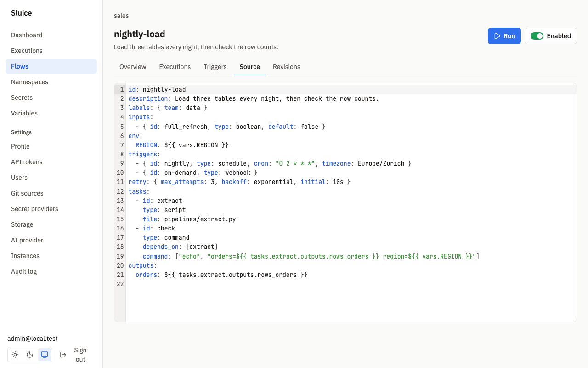
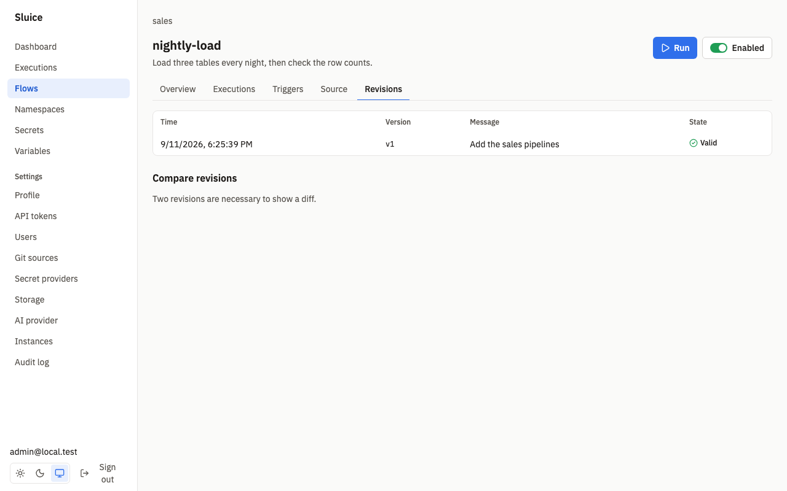

# Flows

This document tells you how to write flow files: tasks, dependencies, inputs, templates, outputs, retries, limits and validation. `README.md` links here. The complete field list is in [reference/flow.md](reference/flow.md). The design is in SDD §6 and §7.5 to §7.6 of [sluice-sdd.md](sluice-sdd.md).

## Files

A flow is one YAML file in a namespace.

| Rule | Value |
|---|---|
| File name | `*.flow.yaml` or `*.flow.yml`, in any directory of the namespace. |
| Flows per file | One. |
| Flow `id` | `^[a-z0-9][a-z0-9-]{0,62}$`. Unique in the namespace. |
| Duplicate `id` | Every file with the duplicate `id` is invalid. |
| Paths in a flow | Relative to the namespace root. |
| Namespace defaults | `namespace.yaml` at the namespace root. It is optional. See [Namespace defaults](#namespace-defaults). |
| Tasks per flow | From 1 to 200. |

A minimal flow:

```yaml
id: hello
tasks:
  - id: say
    type: command
    command: ["echo", "hello from sluice"]
```

A flow with more features:

```yaml
id: load
description: Extract two tables, then report.
labels: { team: data }
inputs:
  - { id: run_date, type: string, default: "2026-09-11" }
  - { id: mode, type: select, values: [full, delta], default: delta }
variables: { DATASET: raw }
env:
  DATASET: ${{ vars.DATASET }}
triggers:
  - { id: nightly, type: schedule, cron: "0 2 * * *", timezone: Europe/Zurich }
concurrency: { limit: 1, behavior: queue }
max_parallel: 4
timeout: 2h
retry: { max_attempts: 3, backoff: exponential, initial: 30s, max: 10m }
tasks:
  - id: extract
    type: script
    file: pipelines/extract.py
    args: ["--date=${{ inputs.run_date }}", "--mode=${{ inputs.mode }}"]
  - id: check
    type: command
    depends_on: [extract]
    command: ["echo", "rows=${{ tasks.extract.outputs.rows }}"]
  - id: notify
    type: http
    depends_on: [check]
    run_if: always
    method: POST
    url: https://hooks.example.com/x
    headers: { Authorization: "Bearer ${{ secret('HOOK_TOKEN') }}" }
    body: '{"rows": ${{ tasks.extract.outputs.rows }}}'
    expect_status: [200, 202]
outputs:
  rows: ${{ tasks.extract.outputs.rows }}
```

Triggers are in [triggers.md](triggers.md).



## Tasks

Each task has these common fields:

| Field | Rule |
|---|---|
| `id` | `^[a-z][a-z0-9_]{0,62}$`. Unique in the flow. Required. |
| `type` | `script`, `command`, `http` or `subflow`. Required. |
| `depends_on` | IDs of tasks that must end first. |
| `run_if` | `success`, `failure` or `always`. Default `success`. See [Dependencies and run_if](#dependencies-and-run_if). |
| `timeout` | Task timeout. Default `24h`. |
| `retry` | Retry policy. See [Retries](#retries). |
| `env` | Environment templates. See [Environment](#environment). |
| `executor` | Where the task runs. Not allowed on `http` and `subflow` tasks. See [executors.md](executors.md). |

A field of another task type is a validation error, for example `url` on a `script` task (`field_not_allowed`).

| Type | Fields | Runs on |
|---|---|---|
| `script` | `file` (required), `runtime`, `args` | an executor |
| `command` | `command` (required), `workdir` | an executor |
| `http` | `method`, `url` (required), `headers`, `body`, `expect_status` | the server instance that claims the task |
| `subflow` | `flow` (required), `inputs`, `wait` | the server instance that claims the task |

### script

A `script` task runs a file of the namespace. `runtime` selects the command. Without `runtime`, the file extension selects it.

| `runtime` | Extension | Command |
|---|---|---|
| `python` | `.py` | `uv run <file> <args>` |
| `bash` | `.sh` | `bash <file> <args>` |
| `bun` | `.ts` | `bun run <file> <args>` |
| `node` | `.js`, `.mjs`, `.cjs` | `node <file> <args>` |

A file with another extension needs `runtime`, otherwise validation reports `unknown_runtime`. The file must be in the namespace snapshot (`file_not_found`). When the tool is not on the executor image, the task fails with reason `runtime_not_found` and the message names the tool. The test SCN-RUN-007 proves this.

```yaml
- id: extract
  type: script
  file: pipelines/extract.py
  args: ["--full-refresh=${{ inputs.full_refresh }}"]
```

`uv run` reads inline script metadata, so a Python script can declare its packages in the file. The `sluice-uv` image has `uv`, a Python 3.12 managed by `uv`, `bash` and `bun`.

### command

A `command` task runs an argv list. There is no shell. To use shell syntax, run the shell explicitly:

```yaml
- id: count
  type: command
  command: ["sh", "-c", "wc -l data/*.csv"]
  workdir: data
```

`workdir` is relative to the namespace root. The default is the root. Templates are not allowed in `file`, `workdir` and `flow`.

### http

An `http` task sends one request from the server instance. It does not use an executor.

| Field | Rule |
|---|---|
| `method` | `GET`, `POST`, `PUT`, `PATCH`, `DELETE` or `HEAD`. Default `GET`. |
| `url` | URL template. Required. |
| `headers` | Header templates. |
| `body` | Body template. |
| `expect_status` | Accepted status codes. Default 200 to 299. |

The task records three outputs: `status`, `headers` and `body`. The body is cut at 1 MiB. When the body is JSON, `body` holds the parsed value. Another status fails the task with reason `http_status`. When the task timeout ends the request, the task is `TIMED_OUT`. The test SCN-EXE-017 proves this.

### subflow

A `subflow` task starts another flow as a child execution.

| Field | Rule |
|---|---|
| `flow` | The child flow as `<namespace>/<flow_id>`. Required. |
| `inputs` | Input templates of the child flow. Sluice checks them against the input types of the child. |
| `wait` | Default `true`. The task ends when the child ends, and its outputs are the child flow outputs. With `false`, the task succeeds when the child starts, and its output `execution_id` holds the child ID. |

Cancel of the parent cancels the child. A chain deeper than 10 fails with reason `depth_exceeded`. The test SCN-EXE-016 proves this. The test SCN-EXE-013 proves that the parent task receives the child outputs.

```yaml
- id: report
  type: subflow
  depends_on: [check]
  flow: sales/weekly-report
```

## Dependencies and run_if

A task starts when all tasks in its `depends_on` have ended and its `run_if` condition is true. Tasks without dependencies start at once. Independent tasks run in parallel, up to `max_parallel`. The test SCN-EXE-003 proves this.

| `run_if` | The task runs when | Otherwise |
|---|---|---|
| `success` | every dependency is `SUCCESS`. | `SKIPPED` with reason `upstream_failed` when a dependency failed, timed out, was cancelled or was skipped with `upstream_failed`. Else `SKIPPED` with reason `run_if_not_met`. |
| `failure` | at least one dependency is `FAILED` or `TIMED_OUT`. | `SKIPPED` with reason `run_if_not_met`. |
| `always` | every dependency has ended. | Not applicable. |

A dependency that is `SKIPPED` with `run_if_not_met` does not satisfy `success` (DI-21).

The execution is `SUCCESS` when every task is `SUCCESS`, or `SKIPPED` with `run_if_not_met`. Otherwise it is `FAILED`, or `TIMED_OUT` when the flow timeout ended it. In the test SCN-EXE-004, task A fails. Its `success` dependent is skipped with `upstream_failed`, and its `failure` and `always` dependents run. The execution is `FAILED`.

Use `run_if: failure` for a cleanup or an alert task:

```yaml
- id: alert
  type: http
  depends_on: [load]
  run_if: failure
  method: POST
  url: ${{ vars.ALERT_URL }}
```

Validation rejects an unknown dependency, a task that depends on itself, a duplicate dependency and a cycle.

## Inputs

Inputs are values that a trigger gives to an execution.

| Field | Rule |
|---|---|
| `id` | `^[a-z][a-z0-9_]{0,62}$`. Unique in the flow. |
| `type` | `string`, `int`, `number`, `boolean`, `select` or `json`. |
| `required` | A trigger must give a value when the input has no default. |
| `default` | It must match the type. Validation reports `invalid_input_default` otherwise. |
| `values` | The allowed values of a `select` input. Required for `select` and not allowed on other types. |
| `description` | Help text on the run form. |

Sluice checks inputs when a trigger creates the execution. An unknown input, a value of the wrong type or an absent required input returns 422 `validation_failed` with one detail for each input. An `int` input accepts whole numbers only. A `json` input accepts any JSON value.

The **Run** dialog of a flow shows one field for each input. The test SCN-FLOW-008 proves the form for string, int, boolean, select and json inputs.

## Environment

The environment of a task comes from three maps. A later map overrides an earlier map by key:

1. `defaults.env` of `namespace.yaml`.
2. Flow `env`.
3. Task `env`.

Env values are templates, and they are the only task fields where `secret()` is allowed. Sluice also sets these variables for every task that runs on an executor. The test SCN-RUN-009 proves this.

| Variable | Value |
|---|---|
| `SLUICE_EXECUTION_ID` | ID of the execution. |
| `SLUICE_TASK_ID` | ID of the task in the flow. |
| `SLUICE_ATTEMPT` | Attempt number, from 1. |
| `SLUICE_NAMESPACE` | Namespace of the flow. |
| `SLUICE_FLOW_ID` | ID of the flow. |
| `SLUICE_OUTPUTS` | Path of the outputs file. See [Outputs, metrics and artifacts](#outputs-metrics-and-artifacts). |
| `SLUICE_WORKDIR` | Directory that holds the namespace files. |

## Templates

A template is `${{ expr }}` in a string. Write `$${{` for a literal `${{`. An expression is a lookup only. There are no operators or function calls, except `secret()`.

| Expression | Value |
|---|---|
| `inputs.<id>` | A flow input. The input must be declared. |
| `vars.<KEY>` | A variable. See the precedence below. |
| `secret('<KEY>')` | A secret value. Double quotes also work. |
| `tasks.<task_id>.outputs.<key>` | An output of an earlier task. |
| `trigger.<path>` | A field of the trigger payload. See [triggers.md](triggers.md#trigger-payload). |
| `execution.id` | ID of the execution. |
| `execution.namespace` | Namespace of the flow. |
| `execution.flow_id` | ID of the flow. |
| `execution.created_at` | Creation time, RFC 3339 in UTC. |

Rules:

- A string value renders as it is. Other JSON values render as compact JSON, for example `42`, `true` or `{"a":1}`.
- Templates are allowed in `env`, `args`, `command`, the `http` fields, `subflow.inputs`, trigger `inputs` and flow `outputs`.
- `secret()` is allowed only in `env` values and in the `http` fields `url`, `headers` and `body`. Elsewhere, validation reports `secret_not_allowed`.
- `tasks.X.outputs` is valid only when X is a dependency of the task, directly or through other tasks. Validation reports `output_reference_not_dependency` otherwise. Flow `env` cannot read task outputs. Flow `outputs` can read the outputs of any task.
- `vars` precedence, from highest to lowest: flow `variables`, the namespace, each parent namespace, global.

Sluice resolves templates when it dispatches the task. A lookup that fails, for example an output that the dependency did not emit, fails the task with reason `template_error`, and no process starts. The test SCN-EXE-012 proves this. A secret that no scope defines fails the task with reason `secret_not_found`, and the error names the key and the scopes searched. The test SCN-SEC-009 proves this. Secret values are masked in logs, outputs and errors. [secrets-and-variables.md](secrets-and-variables.md) tells you how to set secrets and variables.

## Outputs, metrics and artifacts

A task emits outputs, metrics and artifacts through a file. The runner creates the file and puts its path in `SLUICE_OUTPUTS`. The task appends one JSON object per line:

```json
{"type":"output","key":"rows","value":1234}
{"type":"metric","name":"rows_loaded","value":1234,"unit":"rows","tags":{"table":"orders"}}
{"type":"artifact","path":"report.html","name":"report","content_type":"text/html"}
```

The runner reads the file after the process ends. A Python example:

```python
import json, os

with open(os.environ["SLUICE_OUTPUTS"], "a") as f:
    f.write(json.dumps({"type": "output", "key": "rows", "value": 42}) + "\n")
    f.write(json.dumps({"type": "metric", "name": "rows_loaded", "value": 42,
                        "unit": "rows", "tags": {"table": "orders"}}) + "\n")
```

A shell example:

```sh
echo '{"type":"output","key":"status","value":"ok"}' >> "$SLUICE_OUTPUTS"
```

| Line type | Fields | Limits |
|---|---|---|
| `output` | `key`, `value` (any JSON value) | Key at most 256 characters. At most 1 MiB of outputs per task. |
| `metric` | `name`, `value` (a number), `unit`, `tags` | Name `^[a-z][a-z0-9_.]{0,99}$`. At most 8 tags. Tag value at most 128 characters. At most 10 000 metrics per task. |
| `artifact` | `path`, `name`, `content_type` | `path` is relative to the workdir. `name` defaults to the base name of `path` and matches `^[A-Za-z0-9][A-Za-z0-9._-]{0,199}$`. Size at most `SLUICE_MAX_ARTIFACT_BYTES` (default 100 MiB). |

An invalid line gives a warning line in the task log, for example `[sluice] warning: outputs line 4: invalid JSON`. The runner ignores the line, and the task result does not change. The test SCN-RUN-003 proves this.

When a task has several attempts, the execution uses the outputs of the final attempt. The flow `outputs` map is resolved when the execution succeeds. A resolution error sets the execution `FAILED` with reason `output_error`. The execution page shows outputs, metrics and artifacts in its tabs. The flow page charts a metric over the last executions, with an aggregation and an optional tag to group by.

## Retries

A retry policy applies when an attempt ends `FAILED` or `TIMED_OUT`. Sluice then creates a new attempt after the backoff delay. A cancel and the end of the flow timeout do not start a retry. An attempt that ends with reason `lost` or `instance_shutdown` is `FAILED`, so the policy applies.

| Field | Rule |
|---|---|
| `max_attempts` | Number of attempts, with the first attempt. From 1 to 20. Default 1, that is no retry. |
| `backoff` | `fixed` or `exponential`. Default `fixed`. |
| `initial` | First delay. Default `10s`. |
| `max` | Maximum delay. Default `10m`. |

With `fixed`, each delay is `initial`. With `exponential`, the delay after attempt n is `initial` × 2^(n−1). Each delay is at most `max`.

Sluice merges the policy field by field: `namespace.yaml` defaults, then flow `retry`, then task `retry`. In the test SCN-EXE-005, a task with `max_attempts: 3`, `exponential` and `initial: 1s` fails twice. The gaps are at least 1 s and 2 s, and the third attempt succeeds.

## Timeouts

| Timeout | Set by | Default | Effect |
|---|---|---|---|
| Task | Task `timeout`, else `defaults.timeout` of `namespace.yaml` | `24h` | The runner stops the process with SIGTERM, then SIGKILL after 10 s. The task is `TIMED_OUT`. |
| Execution | Flow `timeout` | No limit | Sluice stops all tasks. The execution is `TIMED_OUT`. |

Durations are Go durations, for example `30s`, `10m` or `2h`. A duration must be greater than zero. The test SCN-EXE-006 proves both timeouts.

## Concurrency

`concurrency` limits the executions of one flow that run at the same time. Without the block, the number is unlimited.

| `behavior` | Effect when `limit` executions are active |
|---|---|
| `queue` (default) | The new execution stays `QUEUED` until a slot is free. The limit counts `RUNNING` and `CANCELLING` executions. |
| `skip` | The new execution is `SKIPPED` with reason `concurrency_limit`. The limit counts `QUEUED`, `RUNNING` and `CANCELLING` executions. |

`max_parallel` limits the tasks of one execution that run at the same time. `0` is unlimited and is the default. The tests SCN-EXE-007 and SCN-EXE-003 prove both limits.

## Labels

Flow `labels` is a map of at most 20 entries. Every execution of the flow carries these labels. A manual trigger can add labels, and a trigger label overrides a flow label with the same key. Trigger label keys have 1 to 63 characters without `=` or `,`. Values have at most 256 characters. The **Executions** page and `GET /api/v1/executions` filter by label. The test SCN-EXE-015 proves this.

## Namespace defaults

`namespace.yaml` at the namespace root sets defaults for all flows of the namespace:

```yaml
description: ELT pipelines
defaults:
  executor: { type: kubernetes, pool: cluster-a, image: ghcr.io/acme/elt:1.4.0 }
  env: { TZ: Europe/Zurich }
  retry: { max_attempts: 2 }
  timeout: 1h
```

| Field | Merge rule |
|---|---|
| `defaults.executor` | Field by field: task, then flow, then `namespace.yaml`, then the instance default `process`. |
| `defaults.env` | Flow `env` and task `env` override by key. |
| `defaults.retry` | Flow `retry` and task `retry` override field by field. |
| `defaults.timeout` | The default task timeout. Task `timeout` overrides it. |

The test SCN-NS-006 proves that the defaults apply to a flow without its own values, and that flow values override them. An execution stores its effective definition, that is the flow with the defaults of its snapshot (DI-18).

## Revisions and pinned snapshots

Each save that changes the flow file creates a new flow revision. The **Revisions** tab of the flow lists the revisions and shows a diff between two of them. The test SCN-FLOW-004 proves this.



A new execution pins the namespace head snapshot and the current flow revision (DI-41). A change to the flow or to a script does not affect an execution that has started. The test SCN-EXE-001 proves this.

## Validation

Sluice validates a flow in three places:

- The namespace editor marks errors in flow files and in `namespace.yaml` while you type.
- The server validates each saved version. An invalid flow shows its errors on the flow page. Its triggers are inactive, and a manual trigger returns 422 `flow_invalid`. The test SCN-FLOW-003 proves this.
- `sluice validate` checks a namespace directory offline.

```sh
sluice validate examples/elt/namespace
sluice validate path/to/namespace --json
```

The command prints one line for each flow file and for `namespace.yaml`. For an invalid file, each error line has the file, line, column, code, YAML path and message:

```text
invalid bad.flow.yaml
  bad.flow.yaml:5:23 secret_not_allowed tasks[0].command[1]: secret() is allowed only in env values and http url, headers and body
  bad.flow.yaml:6:42 unknown_dependency tasks[1].depends_on[0]: task "b" depends on unknown task "c"
```

| Exit code | Result |
|---|---|
| 0 | All files are valid. |
| 1 | At least one file is invalid. |
| 2 | Usage error, or the directory cannot be read. |

`--json` prints an object that matches `schemas/validate-result.schema.json`: `valid`, and `files` with `path`, `kind`, `flow_id`, `valid` and `errors`. Each error has `code`, `path`, `line`, `column` and `message`. The test SCN-FLOW-006 proves the exit codes and the schema. The command skips symlinks, `.git` directories and unsafe paths with a warning.

Frequent error codes:

| Code | Cause |
|---|---|
| `yaml_syntax` | The file is not valid YAML. |
| `unknown_field`, `missing_field`, `invalid_type`, `invalid_value` | The structure does not match the schema. |
| `field_not_allowed` | A field of another task type, trigger type or executor type. |
| `duplicate_task_id`, `duplicate_flow_id`, `duplicate_trigger_id`, `duplicate_input_id` | An ID is not unique. |
| `unknown_dependency`, `dependency_cycle` | A bad `depends_on`. |
| `file_not_found`, `unknown_runtime`, `invalid_path` | A bad `file` or `workdir`. |
| `invalid_template`, `unknown_input`, `unknown_task`, `output_reference_not_dependency`, `secret_not_allowed`, `template_not_allowed` | A bad template. |
| `invalid_cron`, `unknown_timezone`, `invalid_reference` | A bad trigger or subflow reference. |
| `executor_not_allowed`, `image_required` | A bad executor. |
| `invalid_duration`, `invalid_input_default`, `out_of_range` | A bad value. |

`GET /api/v1/schemas/flow.json` serves the JSON Schema of flow files without authentication. The file `schemas/flow.schema.json` holds the same schema. The AI assistant can also write and validate flows for you. See [ai.md](ai.md).
