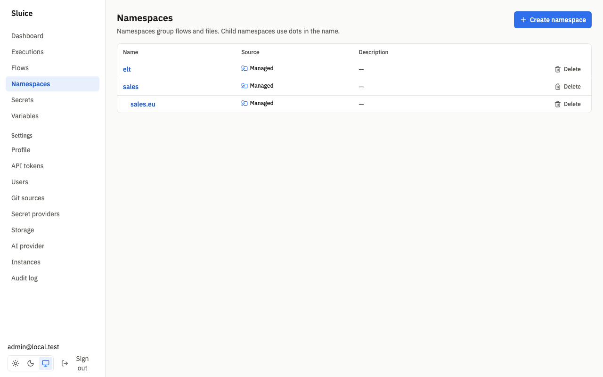
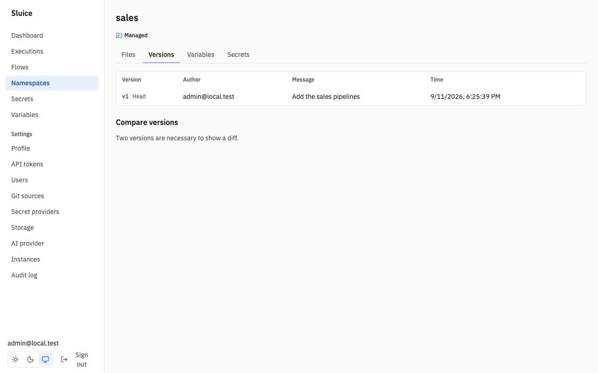
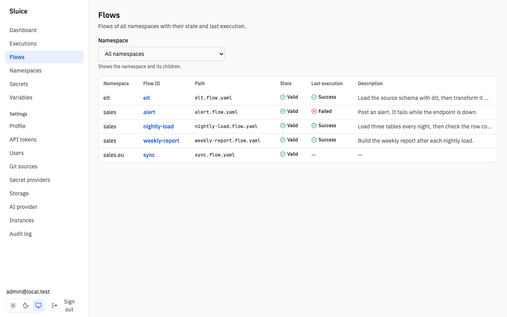
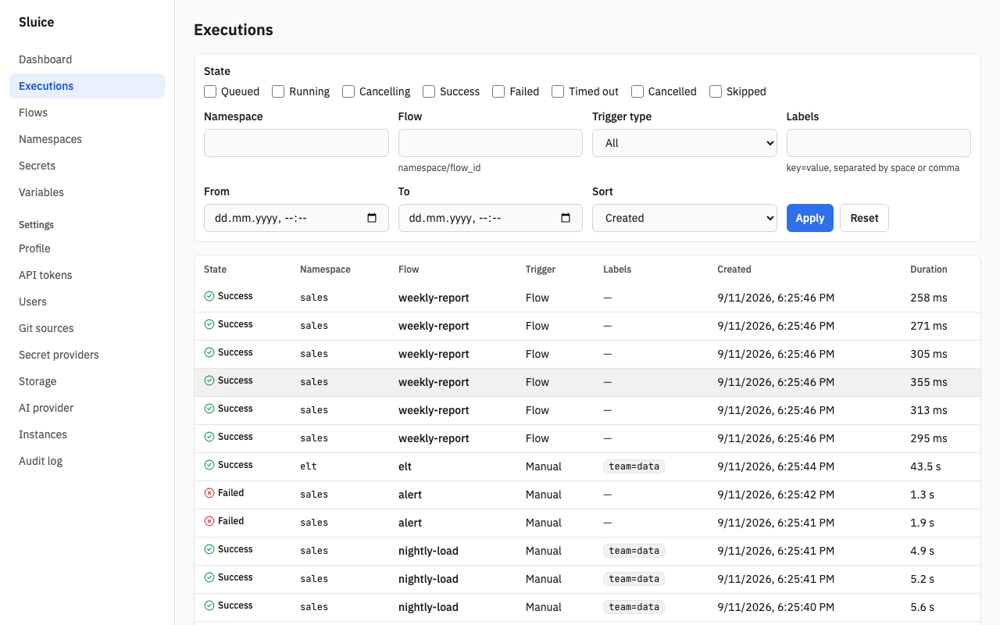

# Get started

This document takes you from an empty machine to a flow that runs on a schedule. `README.md` links here.

You start Sluice with Docker Compose, sign in and create a namespace. Then you add a flow, run it and read the execution. Last, you rerun the flow and add a schedule.


## Requirements

- Docker with the Compose plugin.
- [just](https://just.systems).
- A free host port 8080. To use another port, set `SLUICE_PORT` and `SLUICE_PUBLIC_URL`.

## 1. Start Sluice

`deploy/compose/compose.yml` starts two services:

| Service | Image | Purpose |
|---|---|---|
| `postgres` | `postgres:17-alpine` | The database. |
| `sluice` | `sluice-uv:dev` | The server and the UI. It runs Python, bash and bun tasks on the process executor. |

The compose file reads these variables:

| Variable | Default | Purpose |
|---|---|---|
| `SLUICE_BOOTSTRAP_ADMIN_PASSWORD` | required | Password of the first admin. |
| `SLUICE_MASTER_KEYS` | required | Keys that encrypt builtin secrets, as `kid:base64key`. |
| `SLUICE_BOOTSTRAP_ADMIN_EMAIL` | `admin@local.test` | Email of the first admin. |
| `SLUICE_PORT` | `8080` | Host port of the UI and the API. |
| `SLUICE_PUBLIC_URL` | `http://localhost:8080` | External URL. Cookies and webhook URLs use it. |
| `POSTGRES_PASSWORD` | `sluice` | Password of the database user `sluice`. |

1. Build the images:

   ```sh
   just build-images
   ```

2. Set the two required variables. The compose file does not start without them.

   ```sh
   export SLUICE_BOOTSTRAP_ADMIN_PASSWORD=change-me-now-1
   export SLUICE_MASTER_KEYS="k1:$(openssl rand -base64 32)"
   ```

   Keep the value of `SLUICE_MASTER_KEYS`. Sluice needs the same key at each start to decrypt builtin secrets. Without it, `/readyz` fails with `master_key_missing`.

3. Start Postgres and Sluice:

   ```sh
   docker compose -f deploy/compose/compose.yml up -d
   ```

4. Check that Sluice is ready:

   ```sh
   curl -fsS http://localhost:8080/readyz
   ```

   The check returns 200 when the database, the migrations and the storage are ready. The test SCN-DEP-005 proves that `/readyz` is 200 within 60 s.

Sluice creates the admin user only when the database has no users. A later start with another password does not change the user. The test SCN-AUTH-002 proves this. For a production installation, see [deployment.md](deployment.md).

## 2. Sign in

1. Open <http://localhost:8080>.
2. Type `admin@local.test` in **Email**.
3. Type the password of step 1 in **Password**.
4. Click **Sign in**.

The dashboard opens. It shows the executions of the last 24 hours, the success rate, the executions that run now, the recent failures and the next schedules.


To change your password, open **Settings → Profile**. A new password has at least 10 characters.

## 3. Create a namespace

A namespace holds flow files, scripts, variables and secrets. A managed namespace keeps its files in Sluice, with a version for each save. A git namespace reads its files from a repository. See [git-sync.md](git-sync.md).

1. Click **Namespaces** in the sidebar.
2. Click **Create namespace**.
3. Type `demo` in **Name**.
4. Optional: type a text in **Description**.
5. Click **Create**.

You need the editor role or the admin role. A name has lower case letters, digits and hyphens, and at most 128 characters. A dot makes a child namespace: `demo.eu` is a child of `demo`. A child namespace inherits the variables and secrets of its parents. The test SCN-NS-001 proves the name rules.



## 4. Add a flow

The namespace editor stages new files and edits in the browser. Sluice saves nothing until you click **Save changes** or **Save** (DI-42). A save of several staged files creates one version with one commit message.

1. Click the name of the namespace. The **Files** tab opens.
2. Click **New file**.
3. Type `load.py` in **Path**, then click **Create**. The file shows with the badge **New**.
4. Paste this script into the editor:

   ```python
   import json, os

   print("loading orders")
   report = os.path.join(os.environ["SLUICE_WORKDIR"], "report.txt")
   with open(report, "w") as f:
       f.write("42 rows\n")
   with open(os.environ["SLUICE_OUTPUTS"], "a") as f:
       f.write(json.dumps({"type": "output", "key": "rows", "value": 42}) + "\n")
       f.write(json.dumps({"type": "metric", "name": "rows_loaded", "value": 42,
                           "unit": "rows", "tags": {"table": "orders"}}) + "\n")
       f.write(json.dumps({"type": "artifact", "path": "report.txt",
                           "content_type": "text/plain"}) + "\n")
   ```

5. Click **New file** again.
6. Type `hello.flow.yaml` in **Path**, then click **Create**.
7. Paste this flow into the editor:

   ```yaml
   id: hello
   description: Load rows, then print the count.
   inputs:
     - { id: name, type: string, default: world }
   tasks:
     - id: load
       type: script
       file: load.py
     - id: report
       type: command
       depends_on: [load]
       command: ["echo", "hello ${{ inputs.name }}: ${{ tasks.load.outputs.rows }} rows"]
   outputs:
     rows: ${{ tasks.load.outputs.rows }}
   ```

   The editor validates flow files while you type. An error gets a marker on its line, and a list of validation errors shows below the editor. The test SCN-UI-010 proves that the marker shows within 1 s.

8. Above the file browser, the bar shows **2 unsaved files**. Click **Save changes**.
9. Type a text in **Commit message**, for example `Add the hello flow`.
10. Click **Save**.

Sluice saves both files as one version. The test SCN-NS-002 proves this. The task `load` writes one output, one metric and one artifact through `$SLUICE_OUTPUTS`. The task `report` reads the output through a template. [flows.md](flows.md) explains all flow fields.


The file browser shows the files as a tree. Click a folder to open or close it, or use the arrow keys. Drag the line between the file browser and the editor to change the width. Double-click the line to reset the width.

The editor actions:

| Action | Effect |
|---|---|
| **New file** | Adds an empty staged file. It saves nothing. |
| **Upload** | Saves the selected file at once, with the message `Upload <name>`. |
| **Save changes** | Saves all staged files as one version. The bar with this button shows only when files are staged. |
| **Save** | Opens the **Save file** dialog. It saves only the open file. |
| **Discard** | Removes a staged new file. |
| **Rename**, **Delete** | Apply only to saved files. Each creates a new version. |
| **Run** | Runs a `.py`, `.sh`, `.ts` or `.js` file directly, with optional arguments. You need the operator role. The test SCN-NS-007 proves this. |

Staged content stays while you open other files of the namespace. A page reload discards it. When another user saved the namespace after you opened it, the save fails, and the dialog tells you to reload the page.

The **Versions** tab lists each version with its author, message and time. It shows a diff between two versions and can revert to an earlier version. A revert creates a new version. The test SCN-NS-003 proves this.



## 5. Run the flow

1. Click **Flows** in the sidebar. The list shows each flow with its state and its last execution.
2. Click `hello`. The **Overview** tab opens.
3. Click **Run**. The dialog **Run hello** shows one field for each input.
4. Optional: change `name`, and add labels in **Labels**, one `key=value` per line.
5. Click **Run**. The execution page opens.

You need the operator role or a higher role.




You can also start the flow through the API. Create an API token on **Settings → API tokens**. Then send the request:

```sh
curl -X POST http://localhost:8080/api/v1/flows/demo/hello/executions \
  -H "Authorization: Bearer $SLUICE_TOKEN" \
  -H "Content-Type: application/json" \
  -d '{"inputs": {"name": "docs"}, "labels": {"env": "test"}}'
```

The response is 201 with the new execution. The test SCN-TRG-001 proves this. [triggers.md](triggers.md) describes all the ways to start an execution. [api.md](api.md) describes the API.

## 6. Read the execution

The execution page updates within 2 s of a state change, without a reload. The test SCN-UI-008 proves this.


| Part | What it shows |
|---|---|
| Header | Flow, state, execution ID, and the actions **Cancel**, **Rerun** and **Restart from failed**. |
| Error | For an execution that did not succeed: the task, the reason and the error text. |
| Details | **Duration**, **Trigger**, **Version** of the namespace snapshot, **Created**, **Inputs** and **Labels**. |
| **Timeline** | One bar for each task attempt, for example `load #1`, with its duration and state. A task that a restart reused has the mark `reused`. |
| **Logs** tab | The log lines of all tasks. Filter by **Task**, search with **Search**, and click **Download** to get all lines as a file. New lines show within 2 s while the execution runs. |
| **Outputs** tab | The execution outputs and the outputs of each task. |
| **Metrics** tab | Each metric with its task, name, value, unit and tags. |
| **Artifacts** tab | Each artifact with its name, task, size and type, and a **Download** button. |

For the `hello` flow, you see these results:

- **Logs**: `loading orders` from `load #1` and `hello world: 42 rows` from `report #1`.
- **Outputs**: `rows: 42` for the execution and for the task `load`.
- **Metrics**: `rows_loaded` with value `42`, unit `rows` and tag `table=orders`.
- **Artifacts**: `report.txt`.

Lines that start with `[sluice]` come from the runner, for example a warning about an invalid line in the outputs file. The tests SCN-UI-003 and SCN-RUN-008 prove the timeline, the tabs and the logs. When an admin configures an AI provider, a failed execution also gets a triage. See [ai.md](ai.md).

The **Executions** page lists all executions. It filters by state, namespace, flow, trigger type, labels and time, and it sorts by creation time or duration. The filters stay in the URL. The test SCN-UI-002 proves this.



## 7. Rerun and restart from failed

| Action | Shows for | Effect |
|---|---|---|
| **Cancel** | `QUEUED`, `RUNNING`, `CANCELLING` | Stops the tasks that run and cancels the tasks that did not start. The execution ends `CANCELLED`. The test SCN-EXE-008 proves this. |
| **Rerun** | all states | Creates a new execution with the same snapshot, definition, inputs and labels. All tasks run. |
| **Restart from failed** | `FAILED`, `TIMED_OUT`, `CANCELLED` | Creates a new execution with the same snapshot, definition, inputs and labels. Tasks whose last attempt is `SUCCESS` are reused with their outputs. The other tasks run. |

A rerun and a restart use the snapshot of the original execution. A change to the flow files does not reach them. Variables and secrets resolve again when each task starts. Thus a restart helps when the cause is outside the files, for example an endpoint that was down or a secret that you changed. To run changed files, click **Run** on the flow page.

To restart a failed execution:

1. Open the failed execution.
2. Read the error and the log lines of the failed task.
3. Correct the cause.
4. Click **Restart from failed**. The new execution opens.


The test SCN-EXE-009 proves that a restart reuses the successful tasks and runs the failed task and its dependents. A restart of an execution that succeeded, or that has not ended, returns 409 `not_restartable`. The API operations are `POST /api/v1/executions/{id}/cancel`, `/rerun` and `/restart`.

## 8. Add a schedule

1. Open **Namespaces**, then `demo`, then `hello.flow.yaml`.
2. Add this block after `inputs`:

   ```yaml
   triggers:
     - { id: every-morning, type: schedule, cron: "0 7 * * 1-5", timezone: Europe/Zurich }
   ```

3. Click **Save**. The **Save file** dialog opens.
4. Type a commit message, then click **Save**.
5. Open **Flows**, then `hello`, then the **Triggers** tab.

The schedule is **Active**, and **Next fire time** shows the next weekday at 07:00 in Zurich. The dashboard lists it under **Next schedules**. A schedule fires only when the flow is valid and enabled. The **Enabled** switch on the flow page turns the flow off.


[triggers.md](triggers.md) describes cron syntax, time zones, missed times, webhooks and flow triggers.

## 9. Try the ELT demo

The [ELT example](../examples/elt/README.md) loads a Postgres schema with dlt and transforms it with SQLMesh. Its compose file starts Sluice and a demo warehouse, and `setup.py` loads the example into Sluice and runs it. The execution shows the logs of both tools and the metric `rows_loaded` for each table.


## Remove the stack

This command removes the containers and the database volume. All flows, executions and secrets are lost.

```sh
docker compose -f deploy/compose/compose.yml down -v
```

## Next steps

| Document | What it holds |
|---|---|
| [flows.md](flows.md) | Tasks, templates, outputs, retries and validation. |
| [triggers.md](triggers.md) | Manual runs, schedules, webhooks and flow triggers. |
| [secrets-and-variables.md](secrets-and-variables.md) | Secrets, variables and their scopes. |
| [executors.md](executors.md) | The process, docker and kubernetes executors. |
| [git-sync.md](git-sync.md) | Namespaces from a git repository. |
| [deployment.md](deployment.md) | Production installation with Docker or Helm. |
| [ai.md](ai.md) | The assistant, failure triage and the MCP server. |
