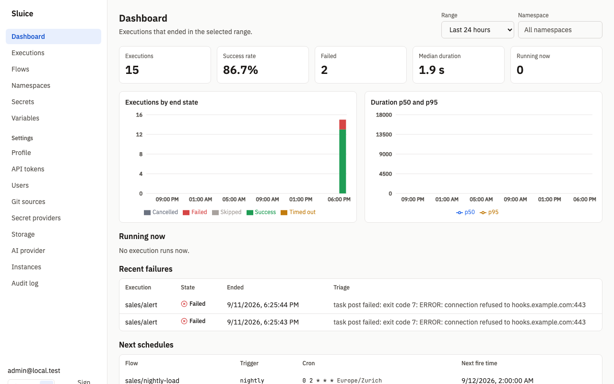

# Metrics

This document lists every Prometheus metric that `/metrics` exposes and defines the dashboard KPIs. `README.md` links here. The requirements are REQ-CORE-004 and REQ-UI-003 in the SDD, and decision DI-37 in [../build/decisions.md](../build/decisions.md).

## Endpoint

Each server instance serves the Prometheus text format at `GET /metrics`. The endpoint needs no credential. Scrape each instance, not the load balancer. The HTTP histogram is local to the instance that served the requests.

```sh
curl -s http://localhost:8080/metrics | grep '^sluice_'
```

`TestSCN_CORE_003_HealthReadyMetrics` checks that `/metrics` has the four `sluice_` series.

## Sluice metrics

The code is in `internal/platform/promx/promx.go`. No other package registers a metric.

| Name | Type | Labels | Description |
|---|---|---|---|
| `sluice_executions` | gauge | `state` | Number of rows in `executions` for each state. |
| `sluice_task_runs` | gauge | `state` | Number of rows in `task_runs` for each state. Each retry attempt is one row. |
| `sluice_queue_depth` | gauge | `pool` | Number of task runs in state `QUEUED` for each pool. |
| `sluice_http_request_duration_seconds` | histogram | `method`, `route`, `status` | Duration of each HTTP request that this instance served. |

### Database gauges

The three gauges come from `SELECT … GROUP BY` queries on each scrape. Thus every instance reports the same values for the whole database. Do not add them across instances. Use `max` or read one instance.

| Gauge | Label values |
|---|---|
| `sluice_executions` | Always all eight states: `QUEUED`, `RUNNING`, `CANCELLING`, `SUCCESS`, `FAILED`, `TIMED_OUT`, `CANCELLED`, `SKIPPED`. A state without rows has the value 0. |
| `sluice_task_runs` | Always all eight states: `PENDING`, `QUEUED`, `RUNNING`, `SUCCESS`, `FAILED`, `TIMED_OUT`, `CANCELLED`, `SKIPPED`. |
| `sluice_queue_depth` | One series for each pool that has queued task runs. When no task run is queued, the only series is `pool="default"` with the value 0. |

The gauges count all rows that retention did not delete yet. The terminal states therefore grow until `SLUICE_RETENTION_DAYS` removes old executions. For rates, use the dashboard API or the change of the gauge over time.

Each query has a 5 s timeout. When a query fails, the scrape has no series for that gauge, and the server logs `metrics query failed` at level `warn`.

### HTTP histogram

| Label | Values |
|---|---|
| `method` | The HTTP method. |
| `route` | The chi route pattern, for example `/api/v1/executions/{executionId}`. The SPA catch-all is `/*`, and unknown API routes are `/api/*`. A request that matched no route has `unmatched`. |
| `status` | The response status code. A handler that wrote no status counts as `200`. |

The buckets are the Prometheus defaults: 0.005, 0.01, 0.025, 0.05, 0.1, 0.25, 0.5, 1, 2.5, 5 and 10 seconds. Server-sent event streams stay open until the execution ends. Their observations therefore show the stream duration, not a response time. The runner routes under `/api/runner/v1` are in the histogram too.

### Process and runtime metrics

The registry also has the standard collectors of `client_golang`:

| Prefix | Collector |
|---|---|
| `go_*` | Go runtime: goroutines, threads, garbage collection and memory statistics. |
| `process_*` | Process: CPU time, resident and virtual memory, open file descriptors, start time and network bytes. |

## Example queries

| Question | PromQL |
|---|---|
| Queued task runs for each pool | `max by (pool) (sluice_queue_depth)` |
| Executions that run now | `max(sluice_executions{state=~"RUNNING\|CANCELLING"})` |
| Failed executions in the last hour | `max(delta(sluice_executions{state="FAILED"}[1h]))` |
| API p95 latency for each route | `histogram_quantile(0.95, sum by (le, route) (rate(sluice_http_request_duration_seconds_bucket{route=~"/api/v1/.*"}[5m])))` |
| API 5xx rate | `sum(rate(sluice_http_request_duration_seconds_count{status=~"5.."}[5m]))` |

The `delta` query gives a wrong result when the retention step deletes executions in the same window.

## Suggested alerts

| Alert | Condition | First step |
|---|---|---|
| Queue grows | `max by (pool) (sluice_queue_depth) > 0` for 15 minutes | Look for `no_instance_for_pool` on the queued task runs. See [runbook.md](runbook.md#stuck-or-lost-executions). |
| Server errors | `sum(rate(sluice_http_request_duration_seconds_count{status=~"5.."}[5m])) > 0` | Find the request ID of the failed request in the server log. |
| Not ready | `/readyz` returns 503 | Read the `failed` list of the response. See [runbook.md](runbook.md#health). |
| Scrape without Sluice gauges | `absent(sluice_executions)` | The metrics query failed. Look for `metrics query failed` in the server log. |

## Dashboard KPIs

The dashboard shows aggregates from `GET /api/v1/stats/dashboard` (REQ-UI-003). The data is in Postgres, not in Prometheus.



### Ranges

| `range` | Span | Bucket |
|---|---|---|
| `24h` | 24 hours | 1 hour |
| `7d` | 7 days | 1 day |
| `30d` | 30 days | 1 day |

The window ends at the end of the current bucket in UTC, and starts one span before. The optional `namespace` parameter selects a namespace and all its children.

### KPI definitions

| KPI | API field | Definition |
|---|---|---|
| Executions | `kpis.executions` | Executions that ended in the window, in the states `SUCCESS`, `FAILED`, `TIMED_OUT`, `CANCELLED` and `SKIPPED`. |
| Success rate | `kpis.success_rate` | `SUCCESS / (SUCCESS + FAILED + TIMED_OUT)` over the executions that ended in the window (DI-37). |
| Failed | `kpis.failed` | Executions that ended `FAILED` in the window. `TIMED_OUT` has its own field, `kpis.timed_out`. |
| Median duration | `kpis.median_duration_ms` | The median of `duration_ms` over executions that ended `SUCCESS`, `FAILED` or `TIMED_OUT` in the window. |
| **Running now** | `kpis.running` | Executions in state `RUNNING` or `CANCELLING` now. The range does not apply. |

The success rate does not count `CANCELLED` and `SKIPPED` executions. A user or a concurrency rule causes these states, so they are not a result of the run. When the window has no execution in `SUCCESS`, `FAILED` or `TIMED_OUT`, the rate is `null` and the UI shows "—".

The response also has `kpis.succeeded`, `kpis.cancelled` and `kpis.skipped`.

### Charts and tables

| Element | API field | Definition |
|---|---|---|
| Executions by end state | `buckets[].success`, `failed`, `timed_out`, `cancelled`, `skipped` | Count of ended executions for each bucket and end state. The bucket of an execution comes from `ended_at`. |
| Duration p50 and p95 | `buckets[].p50_ms`, `buckets[].p95_ms` | The 50th and 95th percentile of `duration_ms` in each bucket, over `SUCCESS`, `FAILED` and `TIMED_OUT`. A bucket without such executions has no value. |
| **Running now** | `running` | Up to 20 executions in `RUNNING` or `CANCELLING`, oldest start first. |
| Recent failures | `recent_failures` | The last 10 executions that ended `FAILED` or `TIMED_OUT`, with the summary of the latest AI triage. The range does not apply. |
| Next schedules | `GET /api/v1/schedules/upcoming` | The next fire times of active schedules. |

This example uses the live data of the screenshot:

```console
$ curl -s -H "Authorization: Bearer $SLUICE_TOKEN" "http://localhost:18082/api/v1/stats/dashboard?range=24h"
{"range":"24h","from":…,"to":…,"bucket_seconds":3600,
 "kpis":{"executions":15,"succeeded":13,"failed":2,"timed_out":0,"cancelled":0,"skipped":0,
         "running":0,"success_rate":0.8666666666666667,"median_duration_ms":1877},
 "buckets":[…],"running":[],"recent_failures":[…]}
```

A range outside `24h`, `7d` and `30d` gets 422 `validation_failed` with the field `range`. The Playwright test `SCN-UI-001` checks that the KPI cards equal the API aggregates.

### Flow charts

The flow page shows two more charts over the last 50 executions of the flow (REQ-UI-006):

| Chart | API | Definition |
|---|---|---|
| State strip and duration | `GET /api/v1/flows/{namespace}/{flowId}/stats` | The last 50 executions, newest first, with state and duration. |
| Custom metric | `GET /api/v1/flows/{namespace}/{flowId}/metrics` | One series for each value of the `group_by` tag. The aggregation is `sum`, `avg` or `max` of the metric values of each execution. |

Tasks emit custom metrics with the emit protocol. See [../flows.md](../flows.md).

## Related documents

- [runbook.md](runbook.md): health checks and operator procedures.
- [../architecture.md](../architecture.md): the components that the metrics describe.
