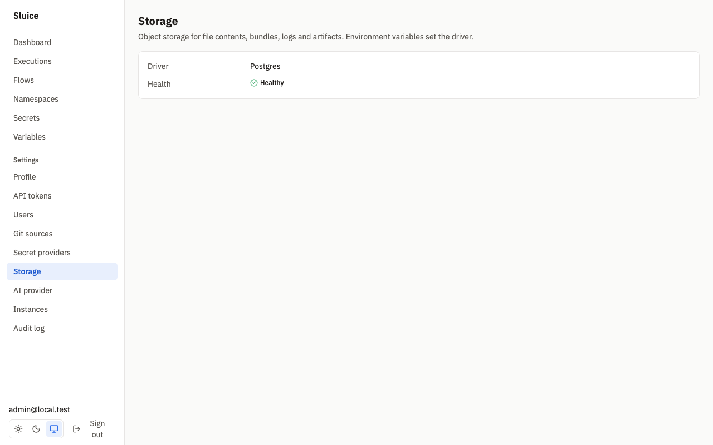
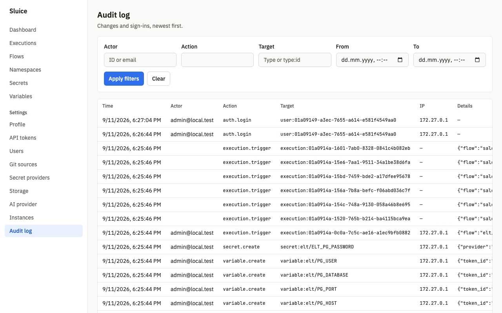

# Runbook

This document holds the operator procedures for a Sluice deployment. `README.md` links here. The components are in [../architecture.md](../architecture.md), the metrics in [metrics.md](metrics.md), and the environment variables in [../reference/env.md](../reference/env.md).

## Health

Each instance serves two health endpoints. Neither endpoint needs a credential.

| Endpoint | Returns 200 when | Use it for |
|---|---|---|
| `GET /healthz` | The process answers HTTP. | Liveness probe. |
| `GET /readyz` | All readiness checks pass. Otherwise 503. | Readiness probe and load balancer checks. |

`/readyz` runs its checks in parallel with a total timeout of 5 s:

| Check | Passes when |
|---|---|
| `database` | `SELECT 1` succeeds. |
| `migrations` | `schema_migrations` has every embedded migration. |
| `storage` | A put, a get and a delete of the key `health/<instance_id>` succeed on the object store. |
| `master_keys` | Every key ID of the stored builtin secrets has a key in `SLUICE_MASTER_KEYS`. |

A healthy response:

```console
$ curl -s http://localhost:8080/readyz
{"status":"ok","checks":{"database":"ok","master_keys":"ok","migrations":"ok","storage":"ok"}}
```

A failed check puts its error text in `checks` and its name in `failed`, and the status is `fail`. `/healthz` stays 200 when a check fails (`TestSCN_CORE_003_HealthReadyMetrics`).

```json
{"status":"fail","checks":{"database":"ok","master_keys":"ok","migrations":"ok","storage":"<error text>"},"failed":["storage"]}
```

The storage status is also on the settings page **Storage**, for admins. It shows the driver and the result of the same round trip.



## Logs

The server writes structured logs with `log/slog` to stderr (REQ-CORE-009).

| Variable | Values | Default |
|---|---|---|
| `SLUICE_LOG_LEVEL` | `debug`, `info`, `warn`, `error` | `info` |
| `SLUICE_LOG_FORMAT` | `json`, `text` | `json` |

Another value stops startup with exit code 2. Each HTTP request has a request ID. The server returns it in the `X-Request-Id` header and adds `request_id` to the log lines of the request. Use the request ID to find the cause of a 500 `internal` error.

These log messages help an operator:

| Message | Level | Description |
|---|---|---|
| `migrations applied` | info | Startup applied new migrations. |
| `bootstrap admin created` | info | The `users` table was empty, and the server created the first admin. |
| `server started` | info | The listener is open. The line has the instance ID and the version. |
| `lease acquired`, `lease lost` | info | The instance became or stopped as leader of the named lease. |
| `lease renew failed` | warn | The database did not answer a lease renew. |
| `instance heartbeat failed` | warn | The instance did not write its heartbeat. |
| `task run lost` | warn | A heartbeat check found that the work of a task run is gone. |
| `maintenance step failed` | warn | A cleanup step failed. The line names the step. |
| `storage gc done` | info | Storage GC ended. The line has the count of deleted objects of each kind. |
| `metrics query failed` | warn | A `/metrics` gauge query failed. |
| `shutdown started`, `shutdown complete` | info | The instance received SIGTERM and stops. |
| `startup failed` | error | The server did not start. The line has the cause. |

## Instances

The settings page **Instances** lists every row of the `instances` table, for admins. The API is `GET /api/v1/instances`. The page refreshes every 10 seconds.


| Column | Source |
|---|---|
| Hostname, Version | The host and the build of the instance. |
| Pools | `SLUICE_POOLS` of the instance. |
| Executors | The enabled executors. `inline` is always on. |
| State | **Online** when the last heartbeat is at most 60 s old, else **Offline**. |
| Last heartbeat | The instance writes it every 10 s. |

An instance is offline after 60 s without a heartbeat. The `maintenance` leader deletes its row after 24 h without a heartbeat (REQ-CORE-007). An instance that comes back writes its row again.

When an instance shows **Offline**:

1. Look at the process or the pod of that host. A normal stop also leaves the row offline for 24 h.
2. Read the last log lines of the instance. Look for `instance heartbeat failed` or `lease renew failed`.
3. Make sure that the instance can reach Postgres.

The `maintenance` leader marks the `RUNNING` `process` and `inline` task runs of an offline instance as `FAILED` with reason `lost`. Their retry policy applies. Docker and Kubernetes work continues, because another instance can check it.

## Stuck or lost executions


Open the execution in the UI, or read it with `GET /api/v1/executions/{executionId}`. Look at the state and the `reason` of each task run.

| Symptom | Cause | Action |
|---|---|---|
| Execution stays `QUEUED` and has no task runs. | The flow `concurrency.limit` is full. | Wait for the active executions of the flow, or cancel one. |
| Task run stays `QUEUED` with `no_instance_for_pool`. | No online instance serves the pool and the executor type of the task. | Start an instance with the pool in `SLUICE_POOLS` and the executor enabled. The task runs when it comes online (`TestSCN_EXR_008_NoInstanceForPool`). |
| Task run stays `QUEUED` without a reason. | All slots of the instances for the pool and the executor type are in use. | Wait, raise `SLUICE_WORKER_SLOTS` or `SLUICE_K8S_MAX_JOBS`, or add instances. Watch `sluice_queue_depth`. |
| Task run is `RUNNING`, and the logs stopped. | The runner can be alive but silent, or gone. | Wait for `SLUICE_HEARTBEAT_TIMEOUT`. When the work is gone, the attempt becomes `FAILED` with `lost` (`TestSCN_EXE_011_LostRunner`). |
| Task run ends `FAILED` with `lost`. | The runner process died, the Job was deleted, or the instance went offline. | Read the task log and the instance logs. The retry policy applies. |
| Task run ends `FAILED` with `instance_shutdown`. | The instance that claimed the task run received SIGTERM. | No action. The retry policy applies. |
| Execution stays `CANCELLING`. | A task run still waits for its runner to stop. | The runner kills the process group 10 s after SIGTERM. The engine ends a task run 60 s after its timeout. |

The engine ends a task run as `TIMED_OUT` when it passed its timeout by 60 s without a `complete` call (DI-20). The `maintenance` leader ends an execution as `TIMED_OUT` after its flow deadline.

## Cancel, rerun and restart

These actions need the `operator` role. They write the audit events `execution.cancel`, `execution.rerun` and `execution.restart`.

| Action | UI | API | Result |
|---|---|---|---|
| Cancel | **Cancel execution** on the execution page | `POST /api/v1/executions/{id}/cancel` | A queued execution becomes `CANCELLED` at once. A `RUNNING` execution becomes `CANCELLING`, then `CANCELLED`. |
| Rerun | **Rerun** | `POST /api/v1/executions/{id}/rerun` | A new execution with the same snapshot, definition, inputs and labels. All tasks run. |
| Restart from failed | **Restart from failed** | `POST /api/v1/executions/{id}/restart` | A new execution with the same snapshot. `SUCCESS` task runs are copied with reason `reused`. The other tasks run. |

Restart from failed works only on a `FAILED`, `TIMED_OUT` or `CANCELLED` execution. Other states get 409 `not_restartable`. Cancel of an ended execution gets 409 `execution_active`. Rerun and restart use the pinned snapshot, so a file change after the first run does not apply. To use the new files, trigger the flow again. The Playwright tests `SCN-EXE-008` and `SCN-EXE-009` prove these actions.

To cancel an execution with the API:

```sh
curl -s -X POST -H "Authorization: Bearer $SLUICE_TOKEN" \
  "$SLUICE_URL/api/v1/executions/$EXECUTION_ID/cancel"
```

The audit log at **Settings → Audit log** shows who cancelled, reran or restarted an execution. It also shows secret, variable and user changes. Admins filter it by actor, action, target and time.



## Retention

The `maintenance` leader deletes ended executions every hour (REQ-EXE-014).

| Data | Kept for | Control |
|---|---|---|
| Executions, with task runs, logs, metrics, artifacts and AI insights | `SLUICE_RETENTION_DAYS` after `ended_at` | Default `90`. |
| Audit events | 365 days | Fixed. |
| Instance rows without a heartbeat | 24 hours | Fixed. |
| Expired sessions | Until the next cleanup | `SLUICE_SESSION_TTL` sets the lifetime. |
| Login attempts | 24 hours | Fixed. |
| Git sync runs | Always | Sluice does not delete them (DI-33). |

To keep executions for a shorter time, set `SLUICE_RETENTION_DAYS` on all instances and restart them. Only the `maintenance` leader applies the value, so all instances must have the same value. The first cleanup runs when an instance takes the lease, then every hour.

## Storage GC

The `maintenance` leader runs storage GC at most once in 24 hours (REQ-STO-006, DI-17). The last run time is in the `settings` row `maintenance.storage_gc_last_run`.

| Object | Deleted when |
|---|---|
| Bundle `bundles/<hash>.tar.gz` | No runner used it for 7 days. |
| File object `files/sha256/<hash>` | No snapshot references it, and it is older than 1 hour. |
| Stored file without a row | No `file_objects` row has its hash, and it is older than 1 hour. |
| Logs and artifacts | Their execution row is gone, and the object is older than 1 hour. |

A deleted bundle is built again when a runner needs it. GC keeps every file object that a snapshot references. The `storage gc done` log line gives the counts.

To run GC earlier, delete the `settings` row. The next hourly maintenance pass then runs GC.

```sql
DELETE FROM settings WHERE key = 'maintenance.storage_gc_last_run';
```

## Backup and restore

Postgres holds all state. The object store holds file content, bundles, archived logs and artifacts.

| `SLUICE_STORAGE_TYPE` | What to back up |
|---|---|
| `postgres` | The database only. The objects are in the tables `storage_objects` and `storage_chunks`. |
| `fs` | The database and the directory `SLUICE_FS_ROOT`. |
| `s3` | The database and the bucket, below `SLUICE_S3_PREFIX`. |
| `azblob` | The database and the container, below `SLUICE_AZBLOB_PREFIX`. |

Also keep a copy of `SLUICE_MASTER_KEYS` outside the database. Without the keys, the builtin secrets in a backup cannot be decrypted.

To back up:

1. Dump the database with `pg_dump`.
2. Copy the object store after the dump.

A copy of the object store that is newer than the dump is safe. Storage GC deletes objects without a reference only after 1 hour.

To restore:

1. Stop all instances.
2. Restore the database.
3. Restore the object store to the same bucket, container, prefix or directory.
4. Set the same `SLUICE_MASTER_KEYS`.
5. Start one instance and make sure that `/readyz` returns 200.
6. Start the other instances.

After a restore, executions that were `RUNNING` in the dump have no live work. The heartbeat checks mark their task runs `lost`, and the retry policy applies.

## Upgrades and migrations

The migrations are embedded in the binary. `sluice server` applies the new migrations at start, in one transaction behind a transaction-scoped advisory lock (REQ-CORE-003, DI-2). When several instances start at the same time, each migration applies once (`TestSCN_CORE_002_ConcurrentMigrations`).

To upgrade:

1. Back up the database and the object store.
2. Optional: run `sluice migrate` with the new version before the rollout.
3. Roll out the new version.
4. Make sure that `/readyz` returns 200 on each instance.

An instance with an older binary reports `migrations not current` in its `migrations` check after a newer version added a migration.

> **Warning:** Before the v1 release, the schema is one file, `db/migrations/00001_init.sql`, and the build changes it in place (DI-4). A database from an earlier build does not get these changes. For a pre-release build, create a new database.

## Master key rotation

`SLUICE_MASTER_KEYS` holds `kid:base64key` pairs separated by commas. Each key is 32 bytes in standard base64. The first key is active for new writes. Other keys only decrypt.

Make a new key:

```sh
openssl rand -base64 32
```

> **Warning:** Do not remove an old key before `sluice secrets rekey` ends. A builtin secret with a key ID that has no key makes `/readyz` fail with `master_key_missing`.

1. Put the new key first: `SLUICE_MASTER_KEYS=k2:<new>,k1:<old>`.
2. Restart all instances with the new value.
3. Run `sluice secrets rekey` with the same environment. It prints `re-encrypted <n> secrets with key k2`.
4. Remove the old key: `SLUICE_MASTER_KEYS=k2:<new>`.
5. Restart all instances.
6. Make sure that `/readyz` returns 200.

`TestSCN_SEC_006_Rekey` proves this procedure. See [../secrets-and-variables.md](../secrets-and-variables.md) and [security.md](security.md).

## Disk and log size

With the `postgres` storage driver, all objects are in Postgres. The database then grows with files, bundles, logs and artifacts.

| Data | Location | Limit |
|---|---|---|
| Live log lines | `log_chunks` table until the task run ends | The server moves them to storage when the task run ends. |
| Archived logs | `logs/<execution_id>/<task_run_id>.ndjson.gz` | Kept for `SLUICE_RETENTION_DAYS`. |
| Artifacts | `artifacts/<execution_id>/<task_run_id>/<name>` | `SLUICE_MAX_ARTIFACT_BYTES` for each artifact. Kept for `SLUICE_RETENTION_DAYS`. |
| Files | `files/sha256/<hash>` | `SLUICE_MAX_FILE_BYTES` for each file. |
| Bundles | `bundles/<hash>.tar.gz` | `SLUICE_MAX_BUNDLE_BYTES` for each snapshot. Deleted 7 days after the last use. |
| Runner buffer | Memory of the task process | 64 MiB when the API is unreachable. |

Find the largest tables:

```sql
SELECT relname, pg_size_pretty(pg_total_relation_size(relid)) AS size
FROM pg_catalog.pg_statio_user_tables
ORDER BY pg_total_relation_size(relid) DESC
LIMIT 10;
```

To reduce the size:

1. Lower `SLUICE_RETENTION_DAYS`.
2. Move objects out of Postgres with the `s3`, `azblob` or `fs` driver. See [../deployment.md](../deployment.md).
3. Run `VACUUM` on the large tables after big deletes.

Many rows in `log_chunks` for ended task runs mean that the log archive failed. Look for `archive logs` warnings in the server log, and for a failed `storage` readiness check.

## Common errors

| Error | Where | Cause | Action |
|---|---|---|---|
| Exit code 2 with a list of variables | Startup | The configuration is not valid. | Fix each named variable. See [../reference/env.md](../reference/env.md). |
| `startup failed` with `migrate:` | Startup | The database is unreachable or a migration failed. | Check `SLUICE_DATABASE_URL` and the database log. |
| `/readyz` 503, `migrations not current` | `/readyz` | The binary expects migrations that the database does not have. | Run `sluice migrate` or restart the newest version. |
| `/readyz` 503, `master_key_missing` | `/readyz` | A builtin secret uses a key ID that is not in `SLUICE_MASTER_KEYS`. | Add the key again. |
| `/readyz` 503, check `storage` | `/readyz` | The object store round trip failed. | Check the storage credentials, the network and the bucket or container. |
| 409 `builtin_provider_disabled` | Secret write | `SLUICE_MASTER_KEYS` is empty. | Set master keys, or use another provider. |
| 403 `csrf_failed` | API with cookie | A cookie request came without a same-origin header. | Use a bearer API token in scripts. Check that the proxy keeps the `Origin` header. |
| 403 `password_change_required` | API | The user has a temporary password. | Log in to the UI and set a new password. |
| 429 `rate_limited` | Login | Too many failed logins for the email or the IP. | Wait for the `Retry-After` time. An admin can reset the password with `sluice user reset-password`. |
| 401 on all requests of a user | API | The user is disabled, or the token is revoked or expired. | An admin checks the user and the token. |
| Task `FAILED` with `secret_not_found` | Task | No scope has the secret key. | Create the secret in the namespace, a parent or the global scope. |
| Task `FAILED` with `template_error` | Task | A template did not resolve at dispatch. | Read the system log line of the task. Fix the flow. |
| Task `FAILED` with `runtime_not_found` | Task | The image has no `uv`, `bash`, `bun` or `node` for the script. | Use an image with the tool, for example `sluice-uv`. |
| Task `FAILED` with `image_pull_failed` | Task | Docker or Kubernetes did not pull the image. | Check the image name and the pull secrets. |
| Task `FAILED` with `executor_error` | Task | The executor is not enabled on the instance that claimed the task run, or the start failed. | Read the system log line of the task. |

## Related documents

- [../architecture.md](../architecture.md): components, leases and the execution lifecycle.
- [../api.md](../api.md): the HTTP API.
- [metrics.md](metrics.md): Prometheus metrics and alerts.
- [../deployment.md](../deployment.md): images, Helm and single-container mode.
- [security.md](security.md): security configuration.
