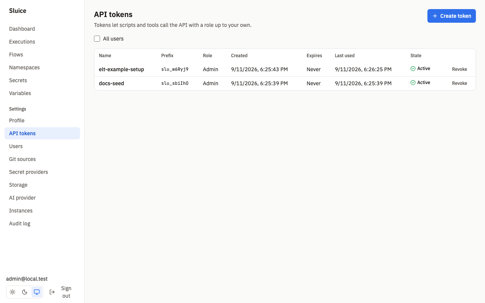
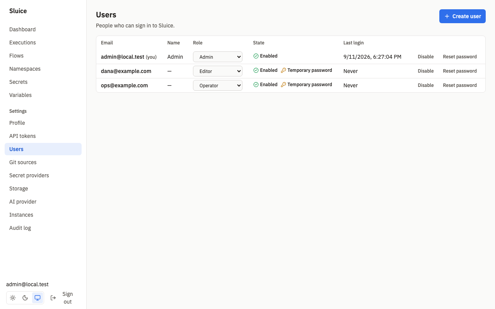

# Security

This document holds the security reference and the protection steps for a Sluice deployment. `README.md` links here. The rules come from SDD §7.2 (authentication and audit), §8 (security invariants SI-01 to SI-12) and Appendix B (permission matrix).

## Checklist

Do these steps before users rely on a deployment:

1. Put TLS in front of Sluice. Set `SLUICE_PUBLIC_URL` to the `https://` URL.
2. Set `SLUICE_MASTER_KEYS` from a secret store. Keep a copy of the keys outside the cluster.
3. Sign in as the bootstrap admin and change the password. Remove the bootstrap variables from the environment.
4. Create one user per person. Give each user the lowest role that the work needs.
5. Give each script, CI job and MCP client its own API token with an expiry and the lowest role.
6. Set `known_hosts` on SSH git sources. Set a webhook secret on each git source that gets webhooks.
7. Run the Helm chart as it is: UID 65532, read-only root file system, no PVC.
8. Read the audit log at regular intervals.

## Authentication

Sluice has its own user accounts (D-16). It has no OIDC, SSO or SCIM in v1. A request authenticates in one of three ways:

| Credential | Where | Used by |
|---|---|---|
| Session cookie `sluice_session` | The UI and the API | Browsers |
| API token in `Authorization: Bearer slu_…` | The API and `/mcp` | Scripts, CI jobs, MCP clients |
| Run token in `Authorization: Bearer …` | `/api/runner/v1` only | `sluice exec` in a task |

Webhooks under `/hooks/` use their own keys or signatures. See [Webhook keys](#webhook-keys).

### Passwords

| Rule | Value |
|---|---|
| Hash | argon2id, m = 19 MiB, t = 2, p = 1 |
| Minimum length | 10 characters |
| Change of the own password | Needs the current password. Other sessions of the user end. The current session stays valid. |
| Temporary password | An admin creates a user or resets a password with a temporary password. Until the user sets a new password, every operation except the own profile and password operations returns `403 password_change_required`. |
| Last admin | The last enabled admin cannot be disabled or demoted: `409 last_admin`. |

When the `users` table is empty, the server creates an admin from `SLUICE_BOOTSTRAP_ADMIN_EMAIL` and `SLUICE_BOOTSTRAP_ADMIN_PASSWORD`. Later starts do not change users, so a changed bootstrap password has no effect. The test `SCN-AUTH-002` proves this.

Recover access with the CLI. It works directly against the database:

```sh
sluice user create --email ops@example.com --role admin --password-stdin --temporary
sluice user reset-password --email ops@example.com --password-stdin
```

Without `--temporary`, the CLI sets a final password.

### Sessions

| Property | Value |
|---|---|
| Cookie | `sluice_session`, `HttpOnly`, `SameSite=Lax`, `Path=/` |
| `Secure` flag | Set when `SLUICE_PUBLIC_URL` starts with `https://` |
| Lifetime | `SLUICE_SESSION_TTL`, default `168h`. It slides: each use extends it, at most once per minute. |
| Storage | Only the SHA-256 hash of the session ID is in Postgres. |
| Logout | Deletes the session. |
| Disable a user, reset a password | Deletes all sessions of that user. |

**Profile → Sign out other sessions** ends all other sessions of the own user.

### API tokens



Create tokens on **Settings → API tokens** (`/settings/tokens`).

| Property | Value |
|---|---|
| Format | `slu_` and 43 base62 characters (256 random bits). |
| Display | Sluice shows the token once, at creation. The list shows only the prefix, for example `slu_w6Ryj9`. |
| Storage | Only the SHA-256 hash is in Postgres. |
| Role | At most the role of the owner. A higher role returns `403`. |
| Effective role | The lower of the token role and the **current** role of the owner. A demoted owner does not keep a higher token (DI-14). |
| Expiry | Optional, 1 to 365 days. Without an expiry the token does not expire. |
| Revoke | The owner or an admin. **All users** shows the tokens of every user to an admin. |
| Rejected with `401` | A revoked token, an expired token, a token of a disabled user. |

A token call does not need an `Origin` header. `last_used_at` updates at most once in 10 seconds. The test `SCN-AUTH-005` proves the role limit, a viewer token, a revoked token and `last_used_at`.

A disable, a role change or a token revoke takes effect on all instances within 5 s, because each request reads the session or the token from Postgres. The test `SCN-AUTH-009` proves this.

## Roles



Sluice has four fixed roles: `viewer < operator < editor < admin`. Each role has all permissions of the lower roles. An admin manages users on **Settings → Users** (`/settings/users`). Custom roles and namespace-scoped roles are not in v1.

### Permission matrix (Appendix B)

| Capability | viewer | operator | editor | admin |
|---|---|---|---|---|
| Read dashboards, flows, files, executions, logs, metrics, variables | ✓ | ✓ | ✓ | ✓ |
| List secret keys and metadata | ✓ | ✓ | ✓ | ✓ |
| Trigger, cancel, rerun, restart, run file | | ✓ | ✓ | ✓ |
| Git "Sync now" | | ✓ | ✓ | ✓ |
| Edit managed files, push branch, enable or disable flows, rotate webhook keys | | | ✓ | ✓ |
| Namespace secrets and variables write, secret check | | | ✓ | ✓ |
| Create managed namespaces | | | ✓ | ✓ |
| AI assistant (read tools) | ✓ | ✓ | ✓ | ✓ |
| AI tools that mutate | per tool | per tool | per tool | per tool |
| Own profile, password, own tokens | ✓ | ✓ | ✓ | ✓ |
| Users, all tokens, global secrets and variables, secret providers, git sources, storage view, AI provider, settings, audit log, delete namespaces | | | | ✓ |

Two decisions refine the matrix:

- Editors can list secret providers, so that the secret form can offer them. Provider changes and provider checks need admin (DI-30).
- `GET /api/v1/instances` needs admin, because instances are a settings page (DI-14).

The AI tool roles are in [ai.md](../ai.md).

### Default deny

Every API operation declares its access in code (D-23). An operation without a declared access does not start the server. The server checks the role before it reads the request body, so a caller without permission never sees validation details. The UI hides actions that the role does not allow, but the server enforces each rule. The test `SCN-AUTH-006` calls every route with every role and compares the result with the matrix.

## Login rate limit

| Rule | Value |
|---|---|
| Failures per email | 10 in 15 minutes |
| Failures per IP address | 50 in 15 minutes |
| Answer above the limit | `429 rate_limited` with `Retry-After` |
| `Retry-After` | Seconds until the oldest failure in the window leaves the window. |

A failure is a wrong password, an unknown email or a disabled user. A rejected `429` attempt is not counted. The counts are in Postgres, so the limit applies across all instances. The test `SCN-AUTH-008` proves that the 11th failure for one email returns 429 with `Retry-After`.

Sluice reads the client IP address from the TCP connection. It does not read `X-Forwarded-For`. Behind a reverse proxy, all clients share the address of the proxy. The per-IP limit then counts all failures together, and the audit log shows the proxy address.

## CSRF: same-origin rule

A request that authenticates with the session cookie and uses `POST`, `PUT`, `PATCH` or `DELETE` must come from the same origin (SI-06, DI-12). Sluice accepts the request when one of these is true:

- `Origin` is equal to the origin of `SLUICE_PUBLIC_URL`.
- `Origin` has the same host as the request `Host`.
- The request has no `Origin`, and `Sec-Fetch-Site` is `same-origin`.

All other cookie requests get `403 csrf_failed`. This includes `Origin: null` and a request with neither header. Requests with an API token do not need `Origin`. The test `SCN-AUTH-011` proves both cases.

Set `SLUICE_PUBLIC_URL` to the URL that the browsers use. When the host differs, the browsers get `403 csrf_failed` on every change.

## Security headers and CSP

Every response, from the UI and from the API, has these headers (SI-12):

| Header | Value |
|---|---|
| `Content-Security-Policy` | `default-src 'self'; frame-ancestors 'none'` |
| `X-Content-Type-Options` | `nosniff` |
| `Referrer-Policy` | `strict-origin-when-cross-origin` |

Every response also has `X-Request-Id`. The server log records the same ID.

The policy has these effects:

- The UI loads scripts, styles, fonts and images only from its own origin. The fonts are in the binary (DI-10). The editor styles use constructed style sheets, not `<style>` elements (DI-16, DI-32).
- No other site can show Sluice in a frame.
- A reverse proxy must not remove or change these headers.

The test `SCN-AUTH-013` proves the headers on UI and API responses.

## Secret guarantees

SI-01 says that no secret value is stored or sent in plain text outside the task process. The table shows how Sluice keeps this rule. [secrets-and-variables.md](../secrets-and-variables.md) holds the details.

| Place | Guarantee |
|---|---|
| Postgres | Builtin values are AES-256-GCM ciphertext. External secrets store only the reference. |
| API responses | No operation returns a secret value. The secret check returns only a status. |
| Logs, outputs, metric tags, errors | The runner masks secret values before it sends them. The server masks again before it stores them. |
| Audit events | Events hold keys and provider names, never values. |
| Object storage | Log archives and artifacts hold only masked text from Sluice. |
| Kubernetes Job and Docker container config | They hold no secret values. The runner gets the values at runtime through the runner API. |
| AI requests and tool results | Execution data is masked with the secret values of every task run. |

A task process itself gets the resolved values in its environment. Sluice cannot stop a script that sends a value somewhere else.

SI-02 says that Sluice stores passwords as argon2id hashes, and session IDs, API tokens, run tokens and webhook keys only as SHA-256 hashes. The test `SCN-AUTH-012` inspects the database for this. The test `SCN-SEC-010` searches a text `pg_dump`, all storage objects, `docker inspect` output and all recorded LLM requests for a canary secret and finds none.

## Run tokens

Each task attempt on an executor gets its own run token (SI-04).

| Property | Value |
|---|---|
| Creation | When a dispatcher claims the task run. |
| Transport | `SLUICE_RUN_TOKEN` in the environment of `sluice exec`. |
| Scope | One task run. A token of task A on task B returns `403`. |
| Validity | Only while the task run is `RUNNING`. |
| Expiry | Task timeout plus 10 minutes. |
| End | Sluice deletes the token hash when the task run ends. Later calls return `401`. |
| Routes | `/api/runner/v1` only. A run token cannot call `/api/v1`. |

A Kubernetes Job holds the run token in its environment, because the runner needs it. The token is scoped and expires, and the Job holds no secret values (DI-35). The test `SCN-RUN-010` proves the token rules.

## Webhook keys

Flow webhook triggers use keys, not user credentials (SI-05, DI-28).

- A webhook trigger has no key until an editor rotates it. `POST /api/v1/flows/{ns}/{flow}/triggers/{trigger}/webhook-key` returns the key and the URL once.
- A key has 256 random bits. Sluice stores only its SHA-256 hash and compares it in constant time.
- A wrong key returns `404`, so a caller cannot find out which flows exist.
- A rotation makes the old key invalid.
- The trigger payload does not store the `Authorization`, `Cookie` and `Proxy-Authorization` headers.

The test `SCN-TRG-005` proves these rules. See [triggers.md](../triggers.md). Git webhooks use an HMAC signature or a token from a global secret. See [git-sync.md](../git-sync.md).

## MCP tokens

`/mcp` accepts only a bearer API token. A session cookie gets `401`. An MCP tool that changes data runs at once, with no confirmation, and writes the audit event `ai.tool.call`.

- Create one token for each MCP client.
- Give the token the lowest role that the client needs. A viewer token gets only the read tools.
- Set an expiry.

See [ai.md](../ai.md).

## Audit log


An admin reads the audit log on **Settings → Audit log** (`/settings/audit`) or with `GET /api/v1/audit`.

| Filter | Query parameter | Value |
|---|---|---|
| Actor | `actor` | A user ID or an email |
| Action | `action` | The exact action, for example `secret.update` |
| Target | `target` | A type, for example `secret`, or `type:id`, for example `secret:sales/DB_PASSWORD` |
| From, To | `from`, `to` | RFC 3339 times |

Each event has the time, the actor type (`user`, `token`, `system`, `ai`), the actor, the action, the target, details and the client IP address. A call with an API token records the token ID in the details. The list is newest first and uses cursor pagination with at most 200 events per page.

These actions are in the log:

| Area | Actions |
|---|---|
| Sign-in | `auth.login`, `auth.login_failed`, `auth.logout`, `auth.revoke_other_sessions` |
| Users | `user.create`, `user.update`, `user.change_password`, `user.reset_password` |
| Tokens | `token.create`, `token.revoke` |
| Secrets | `secret.create`, `secret.update`, `secret.delete`, `secret.rekey` |
| Providers | `secret_provider.create`, `secret_provider.update`, `secret_provider.delete` |
| Variables | `variable.create`, `variable.update`, `variable.delete` |
| Git | `git_source.create`, `git_source.update`, `git_source.delete`, `git_source.sync`, `git.push` |
| Namespaces and files | `namespace.create`, `namespace.delete`, `file.save`, `file.sync` |
| Flows and triggers | `flow.enable`, `flow.disable`, `trigger.webhook_key_rotate`, `trigger.failed`, `trigger.chain_depth_exceeded` |
| Executions | `execution.trigger`, `execution.run_file`, `execution.cancel`, `execution.rerun`, `execution.restart` |
| AI | `ai.provider.update`, `ai.provider.delete`, `ai.triage.request`, `ai.action.confirmed`, `ai.action.rejected`, `ai.tool.call`. See [ai.md](../ai.md#audit-events). |

The maintenance leader deletes events older than 365 days. The test `SCN-AUTH-010` proves that the audit page shows a token creation and a secret update with the actor, and that the filters work.

## TLS and SLUICE_PUBLIC_URL

Sluice serves plain HTTP on `SLUICE_LISTEN_ADDR` (default `:8080`). It has no TLS settings. Terminate TLS at an Ingress, a load balancer or a reverse proxy.

`SLUICE_PUBLIC_URL` is required for `sluice server`. It must be an absolute `http` or `https` URL, otherwise the server stops with exit code 2. Sluice uses it for:

- the `Secure` flag of the session cookie, when the URL is `https://`;
- the same-origin check of cookie requests;
- the webhook URLs of triggers and git sources.

Keep `SLUICE_INTERNAL_URL` on the internal network. Runners call it with run tokens. In Kubernetes, the chart uses the Service URL.

## Container and pod settings

Both images run as the non-root user 65532. The `sluice` image is distroless. The `sluice-uv` image is Debian slim with bash, uv, Python and bun (REQ-DEP-001).

The Helm chart sets these values:

| Item | Value |
|---|---|
| `runAsNonRoot`, `runAsUser`, `runAsGroup`, `fsGroup` | `true`, `65532`, `65532`, `65532` |
| `seccompProfile` | `RuntimeDefault` |
| `readOnlyRootFilesystem` | `true` |
| `allowPrivilegeEscalation` | `false` |
| `capabilities` | drop `ALL` |
| Writable path | `/tmp`, an `emptyDir`. No PVC. |
| RBAC | Jobs: create, get, list, watch, delete. Pods: get, list, watch. `pods/log`: get. Secrets: get, only with `kubernetesSecretProvider.enabled: true`. |

The test `SCN-DEP-002` proves the read-only root file system and the absence of a PVC. See [deployment.md](../deployment.md).

Give the database URL, the master keys and the bootstrap admin to the chart as Kubernetes Secrets: `database.existingSecret`, `masterKeys.existingSecret` and `bootstrapAdmin.existingSecret`.

## Master keys

`SLUICE_MASTER_KEYS` holds the keys that encrypt builtin secrets. Without master keys, builtin secret writes return `409 builtin_provider_disabled` (SI-09). The other providers still work.

Create a key:

```sh
echo "k1:$(openssl rand -base64 32)"
```

Each key must decode to 32 bytes. An invalid value stops the server with exit code 2.

### Rotate the master key

1. Put the new key first and keep the old key: `SLUICE_MASTER_KEYS=k2:<new>,k1:<old>`.
2. Restart all instances. New writes now use `k2`.
3. Run `sluice secrets rekey` once, with the same environment. It prints `re-encrypted <n> secrets with key k2`.
4. Remove the old key: `SLUICE_MASTER_KEYS=k2:<new>`.
5. Restart all instances.

When a stored secret uses a key ID that is not in `SLUICE_MASTER_KEYS`, `/readyz` fails with `master_key_missing`. The test `SCN-SEC-006` proves the rotation and the readiness failure. See [secrets-and-variables.md](../secrets-and-variables.md#master-keys-and-rotation).

## Tests

| Test | Proves |
|---|---|
| `SCN-AUTH-001` | Login error, reload, logout, and `401` for the old cookie. |
| `SCN-AUTH-002` | Bootstrap admin and the user CLI. |
| `SCN-AUTH-003` | A temporary password forces a change. |
| `SCN-AUTH-004` | `409 last_admin`. |
| `SCN-AUTH-005` | Token roles, revoke and `last_used_at`. |
| `SCN-AUTH-006` | Every route with every role matches Appendix B. |
| `SCN-AUTH-007` | Password change ends other sessions. |
| `SCN-AUTH-008` | Login rate limit. |
| `SCN-AUTH-009` | A disable takes effect on another instance within 5 s. |
| `SCN-AUTH-010` | Audit page and filters. |
| `SCN-AUTH-011` | Same-origin rule. |
| `SCN-AUTH-012` | Hashes in the database. |
| `SCN-AUTH-013` | Security headers. |
| `SCN-RUN-010` | Run token rules. |
| `SCN-SEC-010` | No canary secret in the database, storage, container config or LLM requests. |
| `SCN-TRG-005` | Webhook key rules. |

For incident steps, see [runbook.md](runbook.md).
