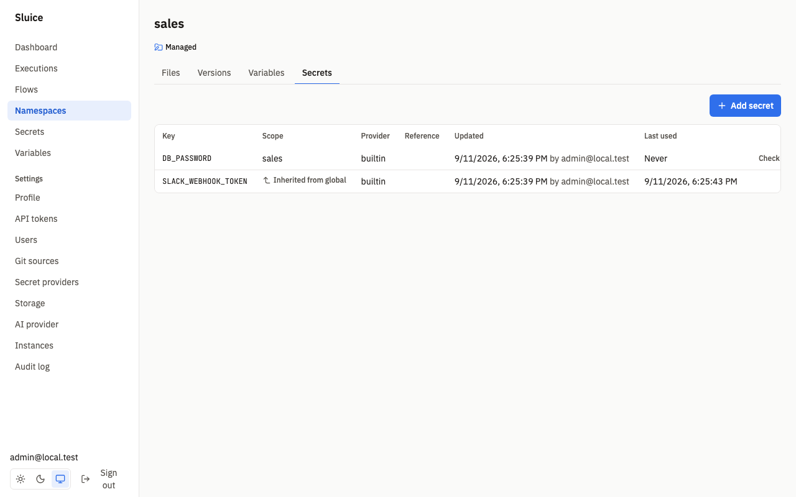
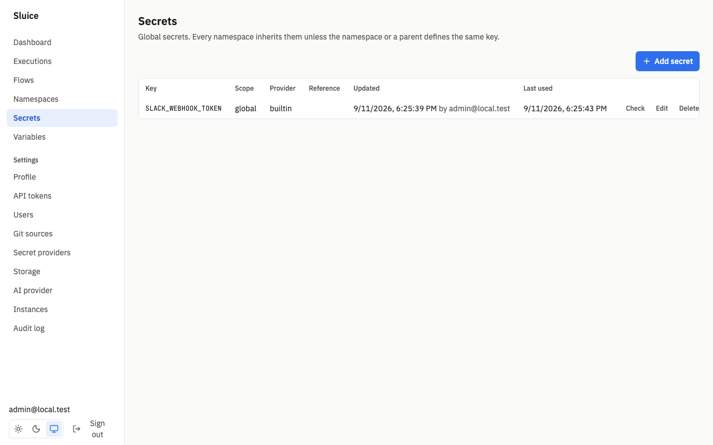
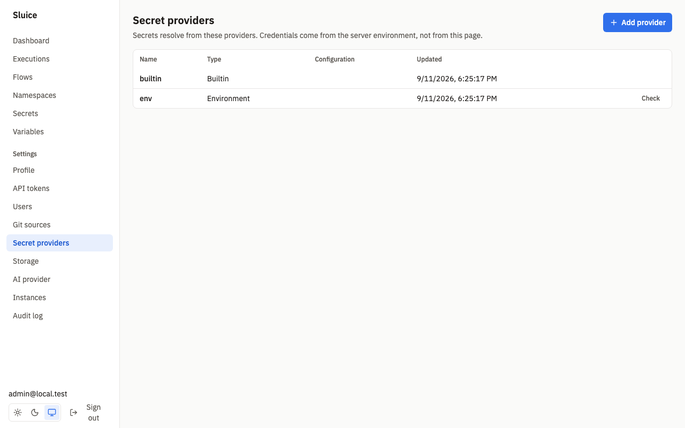
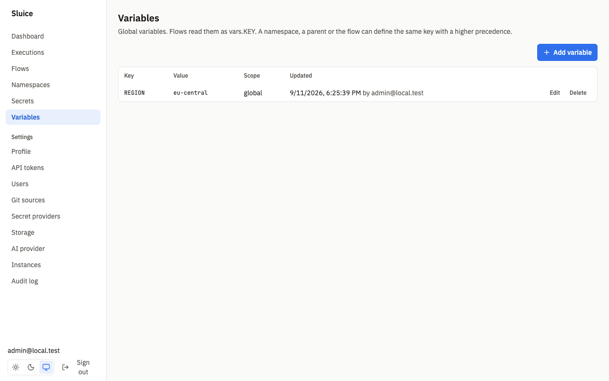
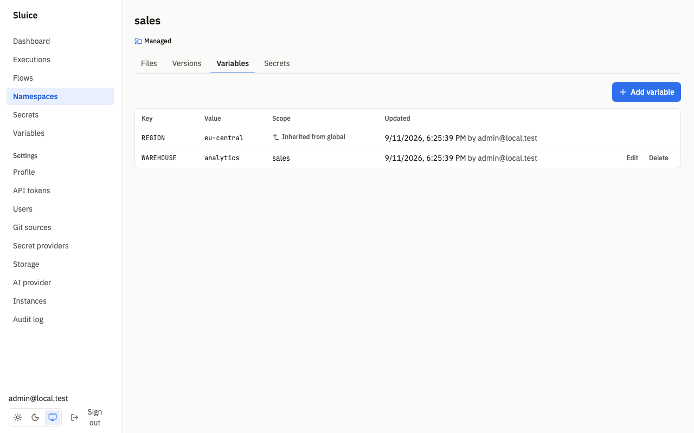
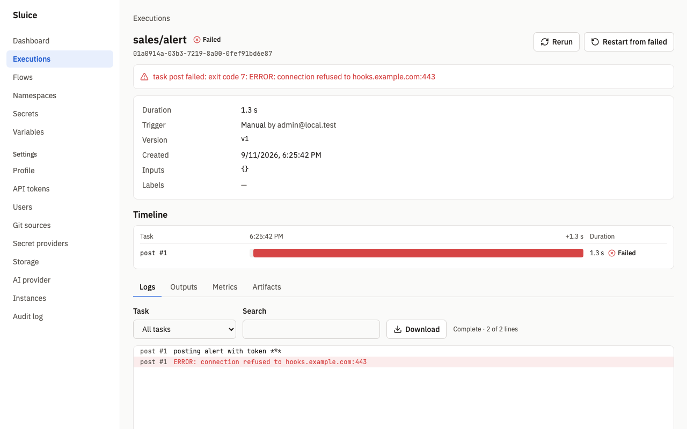

# Secrets and variables

This document holds the reference of secrets, secret providers, variables and masking. `README.md` links here. The design is in SDD §7.10 (REQ-SEC-001 to REQ-SEC-010), §8 (SI-01, SI-09, SI-10) and in the decisions DI-30 and DI-31 of [build/decisions.md](build/decisions.md).

A **secret** is a named value that a task gets at dispatch. Sluice never shows it and masks it in everything that it stores. A **variable** is a named plain value that every user can read. Both have a key and a scope, and a namespace inherits both from its parents and from the global scope.

| | Secret | Variable |
|---|---|---|
| Use in a flow | `${{ secret('KEY') }}` | `${{ vars.KEY }}` |
| Allowed in | `env` values, and `http` `url`, `headers` and `body` | All template fields |
| Value readable through the API or UI | never | yes, by every role |
| Stored | Builtin: AES-256-GCM ciphertext. External: only a reference. | Plain text |
| Masked in logs, outputs, metric tags and errors | yes | no |
| Recorded on the execution | the key, in `secret_keys_used` | no |

## Scopes and inheritance

Each secret and each variable belongs to one scope:

- **global**: the scope for all namespaces.
- **namespace**: one namespace, for example `sales` or `sales.eu`.

Namespace names form a hierarchy with dots. `sales` is the parent of `sales.eu`. A task in a namespace searches for a key in this order:

1. The namespace of the task.
2. Each parent, nearest first.
3. The global scope.

The nearest definition wins. For example, a task in `data.elt.x` searches `data.elt.x`, `data.elt`, `data` and then `global`. When `PG_URL` exists globally, in `data` and in `data.elt`, the task gets the value of `data.elt`. After you delete that secret, the task gets the value of `data`. The test `SCN-SEC-003` proves this.

A namespace scope needs a namespace that exists as a row. An implicit parent, for example `data` when only `data.elt` was created, has no row. A write to it returns `404 namespace_not_found`. Create the parent namespace first (DI-31).

### Inheritance view



The **Secrets** and **Variables** tabs of a namespace show the effective keys: for each key the nearest definition. A key from another scope shows **Inherited from `<scope>`**. You edit an inherited key in its own scope, so the tab shows no **Check**, **Edit** or **Delete** action for it. The test `SCN-UI-010` proves that the secrets page shows an inherited key with its scope.

The API gives the same view. The field `inherited` is `true` when a parent or the global scope defines the key:

```sh
curl http://localhost:8080/api/v1/namespaces/sales.eu/secrets -H "Authorization: Bearer $SLUICE_TOKEN"
```

```json
{"items":[
  {"key":"DB_PASSWORD","scope":"sales","provider":"builtin","provider_type":"builtin",
   "description":"Warehouse password","updated_by":"admin@local.test",
   "updated_at":"2026-09-11T16:25:39.717323Z","inherited":true},
  {"key":"SLACK_WEBHOOK_TOKEN","scope":"global","provider":"builtin","provider_type":"builtin",
   "description":"Token for the alert flow","updated_by":"admin@local.test",
   "updated_at":"2026-09-11T16:25:39.656426Z","last_resolved_at":"2026-09-11T16:25:43.994794Z",
   "inherited":true}
]}
```

The response has no value field.

## Keys

Secret keys and variable keys use the same rule, so that they work in `secret('KEY')` and `vars.KEY`:

| Rule | Value |
|---|---|
| Pattern | `^[A-Za-z_][A-Za-z0-9_]{0,127}$` |
| Length | 1 to 128 characters |
| Uniqueness | One definition per key and scope. The same key can exist in several scopes. |

A key is case-sensitive. `db_password` and `DB_PASSWORD` are two keys.

## Secrets



Manage global secrets on **Secrets** (`/secrets`). Manage namespace secrets on the **Secrets** tab of a namespace. Click **Add secret** and fill in the form.

| Field | Rule |
|---|---|
| `key` | See [Keys](#keys). It is part of the URL. |
| `provider` | The provider name. Default `builtin`. When the secret exists, the default is its current provider. |
| `value` | Builtin secrets only. 1 to 65 536 characters. Write-only. |
| `ref` | External secrets only. At most 512 characters. The format depends on the provider. |
| `description` | Optional. At most 500 characters. |

```sh
# A builtin namespace secret.
curl -X PUT http://localhost:8080/api/v1/namespaces/sales/secrets/DB_PASSWORD \
  -H "Authorization: Bearer $SLUICE_TOKEN" -H "Content-Type: application/json" \
  -d '{"value": "s3cr3t-pa55", "description": "Warehouse password"}'

# A global secret that references Vault.
curl -X PUT http://localhost:8080/api/v1/secrets/PG_URL \
  -H "Authorization: Bearer $SLUICE_TOKEN" -H "Content-Type: application/json" \
  -d '{"provider": "vault", "ref": "data/postgres#url"}'
```

The answer is the secret without its value. An update without `value` keeps the stored value, so you can change only the description. A builtin secret needs a value at creation. An external secret refuses a `value` with `422 validation_failed`.

**Last used** shows the time of the last resolution of the secret for a task. **Never** means that no task used it.

The test `SCN-SEC-002` proves that an editor creates and updates a builtin namespace secret, that the UI never shows the value, that the API has no value field and that the audit events exist.

### Short values

Sluice masks only values with 4 or more characters. The form shows "Values shorter than 4 characters are not masked in logs." when you type a shorter builtin value.

## Builtin secrets and master keys

The `builtin` provider stores the value in Postgres, encrypted:

| Property | Value |
|---|---|
| Cipher | AES-256-GCM with a random nonce for each write |
| Key | The active master key, that is the first key of `SLUICE_MASTER_KEYS` |
| Stored with the value | The key ID of the master key |
| Associated data | `<scope>/<key>`, with scope `global` or the namespace name. A ciphertext copied to another scope or key does not decrypt. |

### SLUICE_MASTER_KEYS

`SLUICE_MASTER_KEYS` holds one or more `kid:base64key` pairs, separated by commas:

```sh
SLUICE_MASTER_KEYS="k2:$(openssl rand -base64 32),k1:<old key>"
```

- `kid` is a name of your choice. Two entries cannot have the same `kid`.
- `base64key` is standard base64 that decodes to exactly 32 bytes.
- The first key is active. Sluice encrypts new values with it. It decrypts each value with the key of its stored key ID.
- An invalid value stops `sluice server` with exit code 2.

Without master keys, a builtin secret write returns `409 builtin_provider_disabled` (SI-09). The other providers still work. The test `SCN-SEC-011` proves this with an `env` secret.

### Master keys and rotation

1. Put the new key first and keep the old key: `SLUICE_MASTER_KEYS=k2:<new>,k1:<old>`.
2. Restart all instances.
3. Run `sluice secrets rekey` once, with the same `SLUICE_DATABASE_URL` and `SLUICE_MASTER_KEYS`.
4. Remove the old key from `SLUICE_MASTER_KEYS`.
5. Restart all instances.

`sluice secrets rekey` encrypts again each builtin secret whose key ID is not the active key. It does all the work in one transaction and writes the audit event `secret.rekey` with the count. It prints:

```text
re-encrypted 12 secrets with key k2
```

Without master keys, the command stops with the error `SLUICE_MASTER_KEYS is empty`.

**Readiness.** When a stored secret uses a key ID that is not in `SLUICE_MASTER_KEYS`, the `master_keys` check of `/readyz` fails with `master_key_missing: no master key for key IDs <ids>`. This happens when you remove the old key before `rekey`. Add the key again and run `rekey`. The test `SCN-SEC-006` proves the rotation and the readiness failure.

## External providers



A provider resolves a reference to a value at dispatch. Sluice never writes to an external secret manager. `builtin` and `env` always exist. An admin adds the other providers on **Settings → Secret providers** (`/settings/secret-providers`) with **Add provider**.

| Type | Configuration | Reference | Credentials |
|---|---|---|---|
| `builtin` | none | none, the value is stored | `SLUICE_MASTER_KEYS` |
| `env` | none | `NAME`: Sluice reads `SLUICE_SECRET_<NAME>`. Default: the secret key. | The server process environment |
| `kubernetes` | `namespace` (optional) | `secret-name/key` | In-cluster service account, or `SLUICE_K8S_KUBECONFIG` |
| `azure_key_vault` | `vault_url` (required, `https://`) | `name` or `name/version` | `DefaultAzureCredential`: `AZURE_*` variables, workload identity or managed identity |
| `vault` | `mount` (default `secret`), `address` (optional) | `path#field` in KV v2 | `SLUICE_VAULT_TOKEN`, or `SLUICE_VAULT_K8S_ROLE` |

The configuration holds no credentials. Sluice accepts only the fields in the table and refuses all other fields with `422 validation_failed`. The credentials come only from the server environment.

| Rule | Value |
|---|---|
| Provider name | `^[a-z0-9][a-z0-9_-]{0,62}$`. A second provider with the same name returns `409 provider_exists`. |
| `builtin`, `env` | Cannot change or be deleted: `409 provider_fixed`. |
| Delete | A provider that a secret uses returns `409 provider_in_use`. |

The test `SCN-SEC-001` proves resolve, not found and access denied for `builtin`, `env`, `azure_key_vault` and `vault` against local substitutes. The test `SCN-SEC-012` proves the `kubernetes` provider and Vault Kubernetes auth in a kind cluster.

### env

The `env` provider reads a variable of the server process. A secret with the reference `PG_URL` reads `SLUICE_SECRET_PG_URL`. Without a reference, the reference is the secret key.

```sh
SLUICE_SECRET_PG_URL=postgres://loader:pw@db:5432/app
```

```sh
curl -X PUT http://localhost:8080/api/v1/secrets/PG_URL \
  -H "Authorization: Bearer $SLUICE_TOKEN" -H "Content-Type: application/json" \
  -d '{"provider": "env"}'
```

Set the variable on every instance, because any instance can resolve secrets for a task. A variable that is not set gives `not_found`.

### kubernetes

The reference is `secret-name/key`. Sluice reads the Secret from the `namespace` of the provider. Without it, Sluice uses `SLUICE_K8S_NAMESPACE`, which defaults to the namespace of the server pod. Outside a cluster, the fallback is `default`.

The service account needs `get` on Secrets. The Helm chart grants it with `kubernetesSecretProvider.enabled: true`.

### azure_key_vault

The reference is the secret name, or `name/version` for one version. `vault_url` is the vault URL, for example `https://acme.vault.azure.net`. Sluice authenticates with `DefaultAzureCredential`.

### vault

The provider reads HashiCorp Vault KV version 2. The reference `data/postgres#url` reads the field `url` of the path `data/postgres` in the mount `mount`.

| Item | Source |
|---|---|
| Address | The provider `address`, else `SLUICE_VAULT_ADDR`. One of them is required. |
| Token auth | `SLUICE_VAULT_TOKEN`. It wins when it is set. |
| Kubernetes auth | `SLUICE_VAULT_K8S_ROLE`. Sluice logs in at `auth/kubernetes/login` with the service account token from `/var/run/secrets/kubernetes.io/serviceaccount/token`. It logs in again at 3/4 of the auth lease, and one time after a 401 or 403 (DI-47). It reads the token file at each login. |

A field that is not a string resolves to its JSON text.

### Provider check

**Check** on a provider row, or `POST /api/v1/secret-providers/{name}/check` with `{"ref": "…"}`, resolves one reference and returns only a status. It needs admin. A check of `builtin` returns `422`, because builtin secrets have no reference.

| Status | Description |
|---|---|
| `ok` | The value resolves. |
| `not_found` | The provider has no value for this reference. |
| `access_denied` | The provider denied access, for example a Vault `403`. |
| `provider_error` | Another error, for example a network error or no Vault address. |

The `message` field explains `not_found`, `access_denied` and `provider_error`. It never holds the value. The test `SCN-SEC-004` proves `ok` and `not_found` for Vault references and checks that no value is in the response.

### Secret check

**Check** on a secret row, or `POST /api/v1/secrets/{key}/check` and `POST /api/v1/namespaces/{namespace}/secrets/{key}/check`, resolves the secret of exactly that scope. It returns the same statuses. A builtin check decrypts the value. An inherited key returns `404 secret_not_found`: check it in its own scope.

### Cache

Sluice keeps resolved `kubernetes`, `azure_key_vault` and `vault` values in memory on each instance for `SLUICE_SECRET_CACHE_TTL` (default `60s`). A change in the external store reaches later dispatches after at most that time, with no restart. A change of the provider configuration takes effect at once. `env` and `builtin` values are not cached. The test `SCN-SEC-005` proves that with a TTL of 1 s the next execution after 2 s gets a changed Vault value.

## Use secrets in flows

Reference a secret with `${{ secret('KEY') }}`. Double quotes work too: `${{ secret("KEY") }}`.

```yaml
id: load-orders
env:
  PG_URL: ${{ secret('PG_URL') }}           # flow env: every task gets it
tasks:
  - id: extract
    type: script
    file: pipelines/orders.py              # reads os.environ["PG_URL"]
    env:
      API_TOKEN: ${{ secret('ORDERS_API_TOKEN') }}
  - id: notify
    type: http
    depends_on: [extract]
    method: POST
    url: https://hooks.example.com/services/${{ secret('SLACK_WEBHOOK_TOKEN') }}
    headers: { Authorization: "Bearer ${{ secret('HOOK_TOKEN') }}" }
    body: '{"text": "orders loaded"}'
```

### Placement rules

`secret()` is valid only in these fields:

- `env` values of the flow and of a task;
- `files` values of a `script` or `command` task;
- `url`, `headers` and `body` of an `http` task.

Everywhere else, for example in `args`, `command`, `subflow.inputs`, trigger `inputs` or flow `outputs`, validation fails with the code `secret_not_allowed` and the message `secret() is allowed only in env values, files values and http url, headers and body`. Pass the secret through `env` and read the environment variable in the script. The test `SCN-FLOW-002` proves the error for `secret()` in `args`.

### Resolution at dispatch

Sluice resolves secrets when a task starts, not when you save the flow. The runner gets the resolved environment at runtime through the runner API. Kubernetes Jobs and Docker containers never hold a secret value (SI-01).

| Result | Task |
|---|---|
| No scope defines the key | FAILED with reason `secret_not_found`. The error names the key and the scopes, for example `secret "PG_URL" not found in scopes data.elt.x, data.elt, data, global`. |
| The provider has no value for the reference | FAILED with reason `secret_not_found`. |
| The provider fails, for example access denied or a network error | FAILED with reason `secret_provider_error`. |

In each case no process starts, and the retry policy of the task applies. The test `SCN-SEC-009` proves `secret_not_found` with the scope list.

The execution records the keys that its tasks used, sorted and without values, in `secret_keys_used`:

```json
{"id": "01a0914a-…", "state": "SUCCESS", "secret_keys_used": ["HOOK_TOKEN", "PG_URL"]}
```

The test `SCN-SEC-008` proves this.

## Variables



Manage global variables on **Variables** (`/variables`). Manage namespace variables on the **Variables** tab of a namespace.



| Field | Rule |
|---|---|
| `key` | See [Keys](#keys). |
| `value` | At most 65 536 characters. |

```sh
curl -X PUT http://localhost:8080/api/v1/namespaces/sales/variables/WAREHOUSE \
  -H "Authorization: Bearer $SLUICE_TOKEN" -H "Content-Type: application/json" \
  -d '{"value": "analytics"}'
```

Read a variable with `${{ vars.KEY }}` in any template field. A flow can also set static values in its `variables` map. The precedence is:

1. `variables` of the flow.
2. The namespace of the flow.
3. Each parent namespace, nearest first.
4. The global scope.

```yaml
id: nightly
variables: { DATASET: raw }
env:
  DATASET: ${{ vars.DATASET }}    # "raw", from the flow
  REGION: ${{ vars.REGION }}      # "eu-central", from global
tasks:
  - id: load
    type: command
    command: ["echo", "${{ vars.WAREHOUSE }}"]   # "analytics", from sales
```

A variable is not a secret. Every role can read it, and Sluice does not mask it. Do not put credentials in variables. The test `SCN-SEC-007` proves inherited values in the UI and the value in the logs of a flow. The test `SCN-EXE-012` proves the precedence.

## Masking



Sluice replaces each secret value that a task resolved with `***` (SI-10). For a value of 4 or more characters, it replaces these forms:

| Form | Example for `a+b/c?` |
|---|---|
| Raw | `a+b/c?` |
| Base64 standard, with and without padding | `YStiL2M/` |
| Base64 URL, with and without padding | `YStiL2M_` |
| URL-encoded, query and path forms | `a%2Bb%2Fc%3F`, `a+b%2Fc%3F` |
| JSON-escaped, with and without HTML escapes | The value with `\"`, `\\`, `\n`, `\r` and `\t`. One form also has `<`, `>` and `&` for `<`, `>` and `&`. |

An encoded form that is shorter than 4 characters is not masked. When two forms overlap, the longer form wins.

Sluice masks in two places:

| Where | What |
|---|---|
| The runner, before it sends | Log lines, output values, metric tag values and the error text |
| The server, before it stores | Log lines, output values, metric tag values and the error text of a completion again. For inline `http` tasks: the log lines, the errors, and the `headers` and `body` outputs. |

The AI features mask execution data with the secret values of all task runs of the execution. See [ai.md](ai.md).

Masking has limits:

- A value with fewer than 4 characters is not masked.
- Metric names and numeric values are not masked.
- Artifact files are masked as they go to storage, with the same forms as logs (DI-46). The stored size is the masked size.
- A task gets the plain values in its environment. A script that transforms a value in another way, for example reverses it, produces text that Sluice does not recognize.

The test `SCN-RUN-005` prints a secret raw, as base64 standard, as base64 URL, URL-encoded and JSON-escaped, and writes it to an output and to the error text. Every stored form shows `***`. The test `SCN-SEC-010` searches the database, the storage, the Docker container config and all LLM requests for a canary secret and finds none.

## Who can do what

| Operation | Role |
|---|---|
| List secret keys and metadata, global and namespace | viewer |
| List variables with values, global and namespace | viewer |
| List secret providers | editor |
| Create, update, delete and check namespace secrets | editor |
| Create, update and delete namespace variables | editor |
| Create, update, delete and check global secrets | admin |
| Create, update and delete global variables | admin |
| Create, update, delete and check secret providers | admin |
| `sluice secrets rekey` | database access, no role |

| Method and path | Role |
|---|---|
| `GET /api/v1/secrets` | viewer |
| `PUT`, `DELETE /api/v1/secrets/{key}` | admin |
| `POST /api/v1/secrets/{key}/check` | admin |
| `GET /api/v1/namespaces/{namespace}/secrets` | viewer |
| `PUT`, `DELETE /api/v1/namespaces/{namespace}/secrets/{key}` | editor |
| `POST /api/v1/namespaces/{namespace}/secrets/{key}/check` | editor |
| `GET /api/v1/secret-providers` | editor |
| `POST /api/v1/secret-providers`, `PUT`, `DELETE /api/v1/secret-providers/{name}` | admin |
| `POST /api/v1/secret-providers/{name}/check` | admin |
| `GET /api/v1/variables`, `GET /api/v1/namespaces/{namespace}/variables` | viewer |
| `PUT`, `DELETE /api/v1/variables/{key}` | admin |
| `PUT`, `DELETE /api/v1/namespaces/{namespace}/variables/{key}` | editor |

A `DELETE` returns `204`. A secret that does not exist returns `404 secret_not_found`. A variable that does not exist returns `404 variable_not_found`. The full matrix is in [operations/security.md](operations/security.md#permission-matrix-appendix-b).

## Audit events

| Action | Target |
|---|---|
| `secret.create`, `secret.update`, `secret.delete` | `secret:<scope>/<key>`. The details hold the provider name, never the value. |
| `secret.rekey` | `secret:*`. The details hold the count and the active key ID. |
| `secret_provider.create`, `secret_provider.update`, `secret_provider.delete` | `secret_provider:<name>` |
| `variable.create`, `variable.update`, `variable.delete` | `variable:<scope>/<key>` |

## Configuration

| Variable | Default | Purpose |
|---|---|---|
| `SLUICE_MASTER_KEYS` | empty | Master keys for builtin secrets. |
| `SLUICE_SECRET_CACHE_TTL` | `60s` | Cache lifetime of external values. |
| `SLUICE_SECRET_<KEY>` | empty | Values for the `env` provider. |
| `SLUICE_VAULT_ADDR` | empty | Vault address. |
| `SLUICE_VAULT_TOKEN` | empty | Vault token. |
| `SLUICE_VAULT_K8S_ROLE` | empty | Vault Kubernetes auth role. Used when no token is set. |
| `SLUICE_K8S_KUBECONFIG` | empty | Kubeconfig for the `kubernetes` provider outside a cluster. |
| `SLUICE_K8S_NAMESPACE` | own namespace | Default namespace of the `kubernetes` provider. |

All variables are in [reference/env.md](reference/env.md).

## Tests

| Test | Proves |
|---|---|
| `SCN-SEC-001` | Provider conformance for builtin, env, azure_key_vault and vault. |
| `SCN-SEC-002` | Builtin namespace secret in the UI, no value in the API, audit. |
| `SCN-SEC-003` | Nearest scope wins. |
| `SCN-SEC-004` | Vault check without the value. |
| `SCN-SEC-005` | The cache TTL. |
| `SCN-SEC-006` | Master key rotation and `master_key_missing`. |
| `SCN-SEC-007` | Inherited variables and `vars.X` in a flow. |
| `SCN-SEC-008` | `secret_keys_used` without values. |
| `SCN-SEC-009` | `secret_not_found` with the scope list. |
| `SCN-SEC-010` | No canary secret in the database, storage, container config or LLM requests. |
| `SCN-SEC-011` | No master keys: `409 builtin_provider_disabled`, env still works. |
| `SCN-SEC-012` | The kubernetes provider and Vault Kubernetes auth in kind. |
| `SCN-RUN-005` | All encoded forms are masked in logs, outputs and errors. |
| `SCN-UI-010` | The secrets page shows an inherited key with its scope. |
