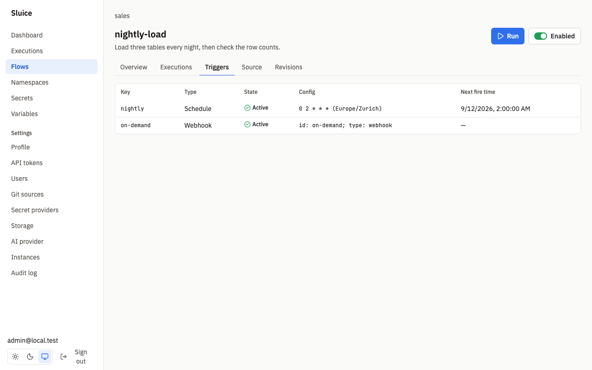

# Triggers

This document describes how executions start: manual runs, schedules, webhooks and flow triggers. `README.md` links here. The design is in SDD §6.5 and §7.7 of [sluice-sdd.md](sluice-sdd.md), and in the decisions DI-26 to DI-29 and DI-36 of [build/decisions.md](build/decisions.md).

## Overview

| Trigger | Declared in the flow | An execution starts when | `trigger_type` |
|---|---|---|---|
| Manual | no | a user clicks **Run**, or a client calls the API. | `manual` |
| Schedule | yes | a cron time arrives. | `schedule` |
| Webhook | yes | a client sends `POST /hooks/<key>`. | `webhook` |
| Flow | yes | an upstream execution ends in a listed state. | `flow` |

Other executions have these trigger types: `rerun`, `restart`, `subflow` and `file` (a file that runs directly). The **Executions** page filters by trigger type.

A declared trigger has these fields:

| Field | `schedule` | `webhook` | `flow` | Rule |
|---|---|---|---|---|
| `id` | yes | yes | yes | `^[a-z][a-z0-9_-]{0,62}$`. Unique in the flow. Required. |
| `type` | yes | yes | yes | `schedule`, `webhook` or `flow`. Required. |
| `cron` | yes | | | Required for `schedule`. |
| `timezone` | yes | | | IANA time zone. Default `UTC`. |
| `catch_up` | yes | | | `last` or `none`. Default `last`. |
| `flow` | | | yes | Upstream flow as `<namespace>/<flow_id>`. Required for `flow`. |
| `states` | | | yes | Upstream end states. |
| `inputs` | yes | yes | yes | Input templates. See [Trigger inputs](#trigger-inputs). |

A field of another trigger type is a validation error (`field_not_allowed`). The full field list is in [reference/flow.md](reference/flow.md#trigger).

## When a trigger fires

A declared trigger fires only when its flow is valid, enabled and not deleted.

| Flow state | Schedule | Webhook | Flow trigger | Manual |
|---|---|---|---|---|
| Valid and enabled | fires | 202 | fires | works |
| Disabled | does not fire | 409 `flow_disabled` | does not fire | works |
| Invalid | does not fire | 422 `flow_invalid` | does not fire | 422 `flow_invalid` |

The tests SCN-FLOW-003 and SCN-FLOW-005 prove this. The **Triggers** tab of a flow shows each trigger as **Active** or **Inactive**. An editor turns a flow off with the **Enabled** switch on the flow page, or through the API:

```sh
curl -X PATCH http://localhost:8080/api/v1/flows/sales/nightly-load \
  -H "Authorization: Bearer $SLUICE_TOKEN" \
  -H "Content-Type: application/json" \
  -d '{"disabled": true}'
```



## Trigger payload

Each execution stores the payload of its trigger. The execution API shows it as `trigger_payload`. Templates read it as `trigger.<path>`.

| `trigger_type` | Payload fields |
|---|---|
| `manual` | none |
| `schedule` | `scheduled_for`: the fire time, RFC 3339 in UTC. |
| `webhook` | `body`, `headers`. See [Webhook](#webhook). |
| `flow` | `execution_id`, `state`, `outputs` and `flow` of the upstream execution. |
| `subflow` | `parent_execution_id`, `parent_task`. |
| `file` | `path`, `args`. |
| `rerun`, `restart` | The payload of the original execution. |

A lookup of a key in a map first tries the exact key, then a match that ignores case. Thus `trigger.headers.X-Source` also finds the header `x-source`.

## Trigger inputs

The `inputs` map of a declared trigger sets flow inputs from the payload. Each value is a template. Sluice renders the templates when the trigger fires:

```yaml
inputs:
  - { id: day, type: string }
  - { id: rows, type: int, default: 0 }
triggers:
  - { id: nightly, type: schedule, cron: "@daily", inputs: { day: "${{ trigger.scheduled_for }}" } }
  - { id: after-load, type: flow, flow: sales/nightly-load, inputs: { rows: "${{ trigger.outputs.orders }}" } }
```

Rules:

- A trigger input template can read `trigger.<path>` only. Every other reference, for example `vars`, `inputs`, `execution`, `secret()` or `tasks`, is the validation issue `trigger_input_reference`, because it has no value when the trigger fires (DI-50).
- A rendered value is text. For an input of type `int`, `number`, `boolean` or `json`, Sluice parses the text as JSON when it can. Thus `"42"` becomes the number 42.
- Sluice then checks the values against the input declarations and applies the defaults, as for a manual run.

When a template or an input check fails, no execution starts:

| Trigger | Result of the failure |
|---|---|
| Webhook | The call returns 422 `validation_failed`, with the input in `details`. |
| Schedule | The audit event `trigger.failed`. The schedule moves to its next fire time. |
| Flow | The audit event `trigger.failed`. The upstream execution ends normally. |

## Manual

A manual run needs no declaration. You need the operator role or a higher role.

- In the UI: open the flow, click **Run**, fill in the inputs and optional labels, then click **Run**.
- Through the API: `POST /api/v1/flows/{namespace}/{flowId}/executions`.

```sh
curl -X POST http://localhost:8080/api/v1/flows/sales/nightly-load/executions \
  -H "Authorization: Bearer $SLUICE_TOKEN" \
  -H "Content-Type: application/json" \
  -d '{"inputs": {"full_refresh": true}, "labels": {"ticket": "OPS-12"}}'
```

The response is 201 with the execution. The execution carries the flow labels and the given labels. A given label overrides a flow label with the same key. At most 20 labels are allowed. A key has 1 to 63 characters without `=` or `,`, and a value has at most 256 characters. The test SCN-TRG-001 proves this.

## Schedule

A schedule trigger starts an execution at each time that its cron expression gives.

```yaml
triggers:
  - { id: nightly, type: schedule, cron: "0 2 * * *", timezone: Europe/Zurich, catch_up: last }
```

### Cron

`cron` has five fields: minute, hour, day of month, month and day of week. It also accepts four descriptors:

| Descriptor | Same as |
|---|---|
| `@hourly` | `0 * * * *` |
| `@daily` | `0 0 * * *` |
| `@weekly` | `0 0 * * 0` |
| `@monthly` | `0 0 1 * *` |

Other descriptors, for example `@yearly` or `@every 5m`, are invalid (`invalid_cron`). When both day fields are restricted, a day matches when either field matches. This is the standard cron rule.

`timezone` is an IANA name, for example `Europe/Zurich`. The default is `UTC`. An unknown name and the name `Local` are invalid (`unknown_timezone`). Cron times are wall times in this time zone.

### Exactly once

The instance that holds the `scheduler` lease checks the schedules each second. Each schedule has a next fire time in the database. The update of that time checks the lease in the same statement, and the database allows one execution for each trigger and fire time. Thus each fire time gives at most one execution across all instances, also when the lease moves. The test SCN-TRG-004 proves this: three instances with a leader change every 2 s create exactly 60 executions in 60 minutes of `* * * * *`.

A new schedule starts at the next fire time after it becomes active. It does not fire times from the past.

### Missed times and catch_up

A fire time counts as missed when a later fire time also passed, or when it passed more than 30 s ago (DI-27). This occurs when no Sluice instance runs, or when the flow was disabled.

| `catch_up` | Effect after missed times |
|---|---|
| `last` (default) | Fires once, for the latest missed time. |
| `none` | Fires no missed time. The next fire time in the future fires normally. |

The test SCN-TRG-003 proves this. An hourly schedule stops over the times 01:00, 02:00 and 03:00. At 03:10, `last` creates one execution for 03:00, and `none` creates none. Both fire at 04:00.

### Daylight saving time

Sluice applies these rules for wall times at a clock change (DI-26):

| Case | Rule | Example with `30 2 * * *` in `Europe/Zurich` |
|---|---|---|
| The wall time does not exist | Fires at the same wall time with the offset before the change, that is one gap later. | On 29 March 2026, 02:30 does not exist. The trigger fires at 03:30 CEST (01:30 UTC). |
| The wall time exists twice | Fires once, at the first instant. | On 25 October 2026, 02:30 occurs twice. The trigger fires at 02:30 CEST (00:30 UTC). |

Thus a daily schedule fires once on each day. The test SCN-TRG-002 proves this.

## Webhook

A webhook trigger starts an execution when a client posts to its URL. The examples in this section use this flow in the namespace `demo`:

```yaml
id: greet
inputs:
  - { id: name, type: string, required: true }
triggers:
  - { id: hook, type: webhook, inputs: { name: "${{ trigger.body.name }}" } }
tasks:
  - { id: say, type: command, command: ["echo", "hello ${{ inputs.name }}"] }
```

### Create the key

A webhook trigger has no key after you save the flow (DI-28). An editor creates the key on the **Triggers** tab of the flow, or through the API. On the tab, click **Rotate key of <trigger>**, confirm, and copy the URL from the dialog **New webhook URL** (DI-51).

1. Create the key through the API:

   ```sh
   curl -X POST http://localhost:8080/api/v1/flows/demo/greet/triggers/hook/webhook-key \
     -H "Authorization: Bearer $SLUICE_TOKEN"
   ```

   ```json
   {"key": "URJG…3BLc", "url": "http://localhost:8080/hooks/URJG…3BLc"}
   ```

2. Store the URL in a safe place. Sluice shows the key only once.

The key has 256 random bits. Sluice stores only its SHA-256 hash. The URL is `SLUICE_PUBLIC_URL` followed by `/hooks/<key>`, so `SLUICE_PUBLIC_URL` must be the address that callers use. The flow detail API shows `has_webhook_key` for each trigger. Each rotation writes the audit event `trigger.webhook_key_rotate`.

To rotate the key, click **Rotate key** again or send the same request again. The new key works at once, and the old key returns 404 at once.

### Call the webhook

The key is the credential. The call needs no other authentication.

```sh
curl -X POST "$WEBHOOK_URL" \
  -H "Content-Type: application/json" \
  -H "X-Source: crm" \
  -d '{"name": "sluice"}'
```

```json
{"execution_id": "01a09151-a036-77a5-90bf-ffb777f1e07e"}
```

| Status | Code | Cause |
|---|---|---|
| 202 | | The execution was created. The body holds `execution_id`. |
| 404 | `not_found` | Wrong key, a rotated key, a removed trigger or a deleted flow. |
| 409 | `flow_disabled` | The flow is disabled. |
| 413 | `body_too_large` | The body is larger than 1 MiB. |
| 422 | `flow_invalid` | The flow is invalid. |
| 422 | `validation_failed` | A trigger input template or an input check failed. |

The test SCN-TRG-005 proves the key, the rotation, the body limit and `trigger.body`.

### Webhook payload

| Field | Value |
|---|---|
| `trigger.body` | The body parsed as JSON when it is valid JSON. Otherwise the body as text. |
| `trigger.headers` | The request headers, with lower-case names and the first value of each header. |

Sluice does not store the headers `Authorization`, `Cookie` and `Proxy-Authorization`. Every user who can read the execution can read the other headers and the body. Do not send credentials in them. The payload of the call above:

```json
{
  "body": {"name": "sluice"},
  "headers": {"accept": "*/*", "content-length": "18", "content-type": "application/json", "user-agent": "curl/8.7.1", "x-source": "crm"}
}
```

Anyone with the URL can start the flow. Rotate the key when the URL becomes known to others. See [operations/security.md](operations/security.md).

## Flow triggers

A flow trigger starts an execution when an execution of another flow ends.

```yaml
id: weekly-report
triggers:
  - { id: after-load, type: flow, flow: sales/nightly-load, states: [SUCCESS] }
tasks:
  - { id: render, type: command, command: ["echo", "report ready"] }
```

| Field | Rule |
|---|---|
| `flow` | The upstream flow as `<namespace>/<flow_id>`. Validation checks only the format. |
| `states` | Any of `SUCCESS`, `FAILED`, `TIMED_OUT` and `CANCELLED`. Without `states`, the trigger fires on every end state (DI-29). |
| `inputs` | Templates over `trigger.execution_id`, `trigger.state`, `trigger.outputs` and `trigger.flow`. |

`trigger.outputs` holds the flow outputs of the upstream execution. Sluice resolves flow outputs only on `SUCCESS`, so after another end state the map is empty.

Sluice fires flow triggers in the transaction that ends the upstream execution. When a downstream execution cannot start, for example because of a bad input, Sluice writes the audit event `trigger.failed`. The upstream execution ends normally.

The test SCN-TRG-006 proves that a downstream flow fires on `FAILED` and receives `trigger.execution_id`. It also proves that the downstream flow does not fire on `SUCCESS` when `SUCCESS` is not listed.

### Chain depth

Each execution has a `chain_depth`. A manual, schedule or webhook execution has depth 0. An execution from a flow trigger has the depth of its upstream execution plus 1. A flow trigger does not fire when the new depth is more than 10. Sluice writes the audit event `trigger.chain_depth_exceeded` instead.

Thus a loop of flow triggers stops. In the test SCN-TRG-006, flow A triggers flow B and flow B triggers flow A. The chain stops after 11 executions, the deepest has depth 10, and one audit event exists.

A subflow child also has the depth of its parent plus 1, and a subflow deeper than 10 fails with `depth_exceeded`. Thus the limit of 10 applies to flow triggers and subflows together.

## Next schedules

Three places show the next fire times of schedules:

- The dashboard lists the next 10 schedules under **Next schedules**.
- The **Triggers** tab of a flow shows **Next fire time** for each schedule.
- `GET /api/v1/schedules/upcoming` returns them for clients. You need the viewer role or a higher role.

| Parameter | Rule |
|---|---|
| `namespace` | Optional. Returns schedules of this namespace and its child namespaces. |
| `limit` | From 1 to 200. Default 10. |

```sh
curl "http://localhost:8080/api/v1/schedules/upcoming?namespace=sales&limit=5" \
  -H "Authorization: Bearer $SLUICE_TOKEN"
```

```json
{"items": [{"namespace": "sales", "flow_id": "nightly-load", "trigger_id": "nightly", "cron": "0 2 * * *", "timezone": "Europe/Zurich", "next_fire_at": "2026-09-12T00:00:00Z"}]}
```

The list holds active schedules of valid, enabled flows only. It is sorted by `next_fire_at`, soonest first. `next_fire_at` is in UTC. The test SCN-TRG-007 proves the order and that disabled flows are not in the list.

## Audit events

Admins read these events on **Settings → Audit log**.

| Action | Written when |
|---|---|
| `execution.trigger` | A trigger created an execution. The details hold the trigger type. |
| `execution.rerun`, `execution.restart` | A user reran or restarted an execution. |
| `execution.run_file` | A user ran a file directly. |
| `trigger.webhook_key_rotate` | An editor created or rotated a webhook key. |
| `trigger.failed` | A schedule or flow trigger did not start an execution. The details hold the error. |
| `trigger.chain_depth_exceeded` | A flow trigger did not fire because of the chain depth. |
