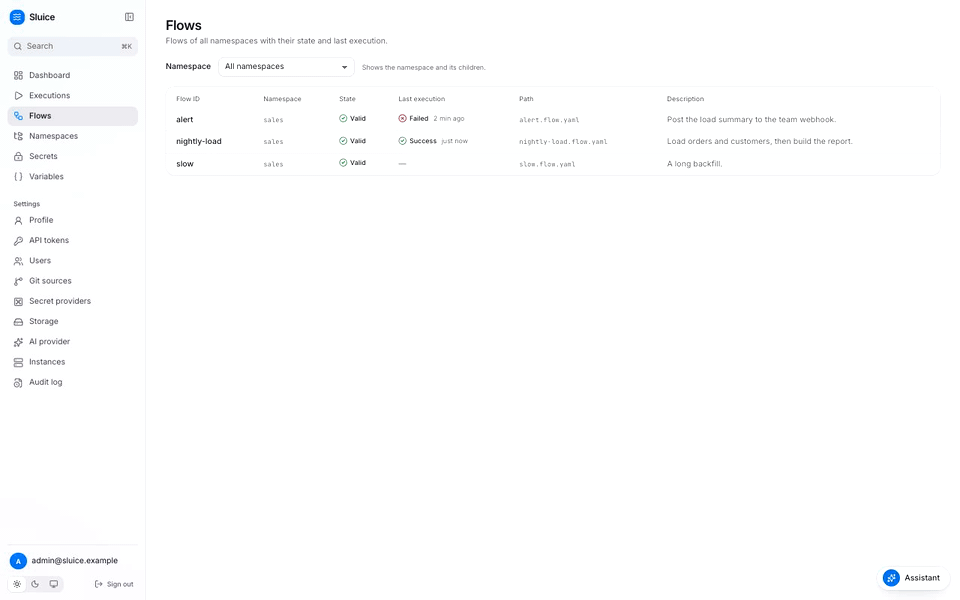

import Shot from "../../../components/Shot.astro";
import { Steps, Tabs, TabItem, LinkCard, CardGrid } from "@astrojs/starlight/components";

In this tutorial, you start Sluice on your computer and write a flow with two tasks. You run the flow from the web UI and read its execution. Then you run the same flow from a terminal with the `sluice` CLI.



## Before you start

You need these tools:

- Docker with the Compose plugin.
- git.
- A free host port 8080.

## Start Sluice

The file `deploy/compose/compose.yml` in the Sluice repository starts two services. The `postgres` service is the database. The `sluice` service is the server and the web UI. Its image, `sluice-uv:dev`, runs Python, bash and bun tasks on the process executor.

<Steps>

1. Clone the repository and go into it:

   ```sh
   git clone https://github.com/alternayte/sluice.git
   cd sluice/
   ```

2. Set the two variables that the compose file requires:

   ```sh
   export SLUICE_BOOTSTRAP_ADMIN_PASSWORD=change-me-now-1
   export SLUICE_MASTER_KEYS="k1:$(openssl rand -base64 32)"
   ```

   `SLUICE_BOOTSTRAP_ADMIN_PASSWORD` is the password of the first admin. `SLUICE_MASTER_KEYS` holds the key that encrypts secrets. Keep this value. Sluice needs the same key at each start to decrypt the secrets that it stores.

3. Start Postgres and Sluice:

   ```sh
   docker compose -f deploy/compose/compose.yml up -d
   ```

   The first start builds the image `sluice-uv:dev` from the repository.

4. Check that Sluice is ready:

   ```sh
   curl -fsS http://localhost:8080/readyz
   ```

   The response is `{"status":"ok", …}` with one check each for the database, the master keys, the migrations and the storage.

</Steps>

The compose file also reads these optional variables:

| Variable | Default | Purpose |
|---|---|---|
| `SLUICE_BOOTSTRAP_ADMIN_EMAIL` | `admin@local.test` | Email of the first admin. |
| `SLUICE_PORT` | `8080` | Host port of the UI and the API. |
| `SLUICE_PUBLIC_URL` | `http://localhost:8080` | External URL. Cookies and webhook URLs use it. |
| `POSTGRES_PASSWORD` | `sluice` | Password of the database user `sluice`. |

Sluice creates the admin only when the database has no users. A later start with another password does not change the admin.

## Sign in

<Steps>

1. Open [http://localhost:8080](http://localhost:8080).
2. Type `admin@local.test` in **Email**.
3. Type the password from the last section in **Password**.
4. Click **Sign in**.

</Steps>

The dashboard opens. It shows the executions of the last 24 hours, the success rate, the running executions, the recent failures and the next schedules. All of them are empty for now.

<Shot name="dashboard" alt="The dashboard with KPI cards, the executions chart, recent failures and next schedules." />

## Create a namespace

A namespace holds flow files and the scripts that they run. Each save of a namespace makes a new version.

<Steps>

1. Click **Namespaces** in the sidebar.
2. Click **Create namespace**.
3. Type `demo` in **Name**.
4. Click **Create**.

</Steps>

The list shows the namespace `demo`. A name has lower case letters, digits and hyphens. A dot makes a child namespace, for example `demo.eu`.

## Add a flow

<Steps>

1. Click `demo` in the list. The **Files** tab opens and shows "This namespace has no files."
2. Click **Create a file**.
3. Type `hello.flow.yaml` in **Path**, then click **Create**. The editor opens the new file.
4. Paste the flow from the code block below this list into the editor.
5. Click **Save** above the editor. The **Save file** dialog opens with the commit message `Create hello.flow.yaml`.
6. Click **Save**.

</Steps>

This is the flow:

```yaml flow
# yaml-language-server: $schema=https://sluice-docs.pages.dev/schemas/flow.schema.json
id: hello
description: Greet someone, then report the count.
inputs:
  - { id: name, type: string, default: world }
tasks:
  - id: greet
    type: command
    env:
      NAME: ${{ inputs.name }}
    command:
      - sh
      - -c
      - |
        echo "hello $NAME"
        echo '{"type":"output","key":"count","value":3}' >> "$SLUICE_OUTPUTS"
        echo '{"type":"metric","name":"greetings","value":3,"unit":"rows"}' >> "$SLUICE_OUTPUTS"
  - id: report
    type: command
    depends_on: [greet]
    command: ["echo", "greet counted ${{ tasks.greet.outputs.count }}"]
outputs:
  count: ${{ tasks.greet.outputs.count }}
```

The flow has one input, `name`, with the default `world`. The task `greet` prints a greeting. It also writes one output and one metric to the file in `$SLUICE_OUTPUTS`. The task `report` starts after `greet` and reads the output through the template `${{ tasks.greet.outputs.count }}`.

The editor validates a flow file while you type. A mistake gets a marker on its line, and a list of validation errors shows below the editor. To see it, change `depends_on: [greet]` to `depends_on: [greeting]`. Then change it back.

<Shot name="editor" alt="The namespace editor with the file tree on the left and a flow file open on the right." />

## Run the flow

<Steps>

1. Click **Flows** in the sidebar. The list shows `demo/hello`.
2. Click `hello`. The **Overview** tab of the flow opens.
3. Click **Run**. The dialog **Run hello** shows the field `name` with the value `world`.
4. Click **Run** in the dialog.

</Steps>

The execution page opens. You need the operator role or a higher role to run a flow. The admin has all roles.

## Read the execution

The execution page updates live while the tasks run. It has three parts:

- The header shows the flow, the state, the execution ID and the buttons **Download JSON** and **Rerun**.
- The details show **Duration**, **Trigger**, **Version**, **Created** and **Inputs**.
- The **Timeline** on the left shows one bar for each task attempt, `greet #1` and `report #1`. The inspector on the right shows the logs, outputs, metrics and artifacts.

<Shot name="execution" alt="A succeeded execution: the timeline with four task bars on the left and the log lines of the task extract_orders on the right." />

Look at the result of your run:

<Steps>

1. Read the **Logs** tab. It shows `hello world` from `greet` and `greet counted 3` from `report`.
2. Click the bar `greet #1` in the **Timeline**. A card shows the task type, the executor, the duration, the queue wait and the exit code. The tabs now show only the data of `greet`.
3. Click **Outputs**. The task `greet` has the output `count` with the value `3`.
4. Click **Metrics**. The metric `greetings` has the value `3` and the unit `rows`.
5. Click **All tasks** on the card to show the data of all tasks again.

</Steps>

The log viewer has a search field, a **Task** filter and a **Download** button. **Follow** keeps the newest line in view while the execution runs. **Wrap** wraps long lines. Drag the line between the timeline and the inspector to change their widths.

Go back to the flow page. The **Overview** tab now shows the last execution, a chart of the durations and a chart of the metric `greetings`.

## Run the flow from a terminal

The `sluice` binary is also a client of the server. It needs the URL of the server and an API token.

<Steps>

1. Click **API tokens** under **Settings** in the sidebar.
2. Click **Create token**.
3. Type `cli` in **Name** and select **Operator** in **Role**.
4. Click **Create token**. The dialog shows the token once.
5. Click **Copy**, then click **Done**.

</Steps>

Get the `sluice` binary. The client commands are in the releases after v0.1.2.

<Tabs>
  <TabItem label="Release">
    Run the installer. It downloads the newest release for your system, checks it against the published checksum, and puts `sluice` in `/usr/local/bin`:

    ```sh
    curl -fsSL https://raw.githubusercontent.com/alternayte/sluice/main/install.sh | sh
    ```
  </TabItem>
  <TabItem label="Build from source">
    Build the binary in the repository with Go:

    ```sh
    go build -o sluice ./cmd/sluice
    sudo mv sluice /usr/local/bin/
    ```
  </TabItem>
</Tabs>

Set the URL and the token, then run the flow with another input:

```sh
export SLUICE_URL=http://localhost:8080
export SLUICE_TOKEN=slu_paste-your-token-here
sluice run demo/hello --wait --input name=cli
```

`--wait` streams the log lines to stderr until the execution ends. Then the command prints the end state and the URL of the execution:

```text
waiting for http://localhost:8080/executions/01a0d50c-3d6c-7e9a-b851-f963f7aaf81b
[greet#1] hello cli
[report#1] greet counted 3
SUCCESS demo/hello 01a0d50c-3d6c-7e9a-b851-f963f7aaf81b in 303ms
http://localhost:8080/executions/01a0d50c-3d6c-7e9a-b851-f963f7aaf81b
```

The exit code is the end state: `0` for `SUCCESS` and `10` for `FAILED`. [Exit codes](/reference/exit-codes/) lists all codes. List the executions of the flow to see both runs:

```sh
sluice executions list --flow demo/hello
```

## Remove the stack

This command removes the containers and the database volume. It deletes all flows, executions and secrets.

```sh
docker compose -f deploy/compose/compose.yml down -v
```

## Next steps

<CardGrid>
  <LinkCard title="Build an ELT pipeline" href="/tutorials/build-an-elt-pipeline/" description="Load a database with dlt, transform it with SQLMesh, and chart the rows loaded." />
  <LinkCard title="Schedule a flow" href="/how-to/schedule-a-flow/" description="Run a flow on a cron schedule in a time zone." />
  <LinkCard title="Pass data between tasks" href="/how-to/pass-data-between-tasks/" description="Outputs, metrics and artifacts." />
  <LinkCard title="The flow file" href="/reference/flow/" description="Every field of a flow file." />
</CardGrid>
